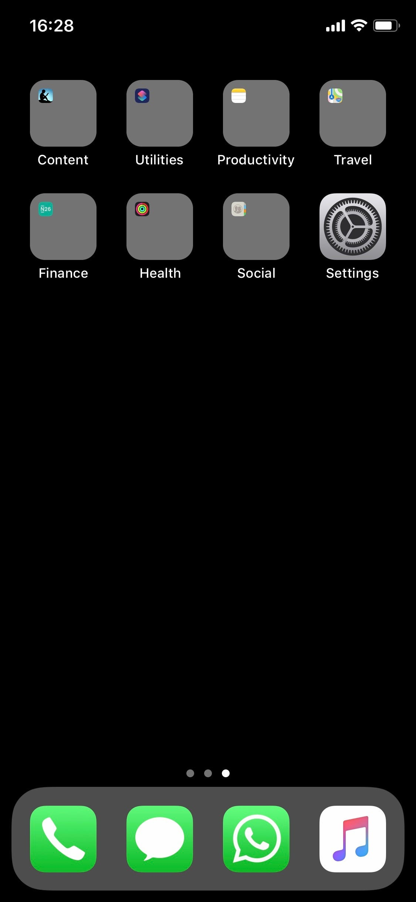

_Inspired by_ [_M.G. Siegler_](https://medium.com/u/5c6977d2a94f)

I used to be more than crazy when it comes to organizing my phone’s homescreen. It all started when I was using an Android phone, and I had control over every little detail of the app launcher. Getting into Apple’s garden meant being restricted to 4x6 icons grid, four icons in the dock, pages, and the changing the wallpaper. Even though it doesn’t sound like a lot of opportunity for tweaking, during 2.5 years I came up with a variety of different approaches to sorting apps on my iPhone.

My latest homescreen, that I’ve been now using for more than half a year, is as simple as it can get for me. The general idea behind it is to have easy access to apps, that are truly useful for me, or that are a better use of time than browsing through the Instagram feed.

I can’t get along without using any sort of calendar app. For a long time I’ve been using Fantastical, but I like Siri Suggestions inside Apple’s own **Calendar** app. And even though I’m using **Things** for managing most of my personal tasks, I’m also using **Reminders** a lot, but excessively via Siri. It’s great for location-based appointments and making shopping lists on HomePod.

Even though Berlin is as international as it can get in a non-English-speaking country, it’s still useful to know some German here. Currently, I’m getting to know some vocabulary with **Duolingo**. I also use **Google Translate** for translating documents, using live translation feature, and reading emails.

There is no phone in 2019 that doesn’t have at least four different communication apps installed. I really hate how fragmented the messaging experience nowadays is, and I wish someone would solve it. Before that happens, I’m stick to having all **Messenger**, **Telegram**, and **WhatsApp** installed, with the addition of Apple’s own **Messages** and **Phone**.

Getting around Berlin isn’t that hard, and the public transport here works pretty well most of the time. For real-time travel planning, I’m using **Citymapper**, which features Siri Shortcuts integration. It allows me to quickly check my ETA to the office or any saved location. Transit data in **Google Maps** works well too, but I use the app only for looking up places and saving things to check out later. **Apple Maps** do actually work great in Berlin, but they are still a little behind Google’s app regarding being up-to-date with new locations.

I love how great **Instapaper**, the read-later app, is and I can’t imagine not using it like I had to [earlier last year](http://blog.instapaper.com/post/176732408411). But it works now, and please, stay that way.

Yes, I’m one of the sick people who is subscribing to [**Apple Music**](https://dmarcinkowski.pl/blog/apple-music-revisited/ "Apple Music, revisited") instead of Spotify. Besides missing out on my friend’s playlist, I’m really happy with the overall experience of using Apple’s platform. And it works with [HomePod](https://dmarcinkowski.pl/blog/homepod-is-great-dont-buy-it/ "HomePod is great. Don’t buy it.") and Siri, which makes me stick to it if I want it or no.

My second screen is just full of folders and **Settings** icon hanging in the corner. I use the [_candy jars_](https://medium.com/thrive-global/distracted-in-2016-reboot-your-phone-with-mindfulness-9f4c8ad46538) practice, and it’s been working pretty well for me. I don’t really check the page that often since I launch most of the apps via Spotlight. That’s also a reason why I don’t mention above many of my favorite apps, like **1Password**, **Reeder**, or **Foursquare** — I launch them only when needed.
