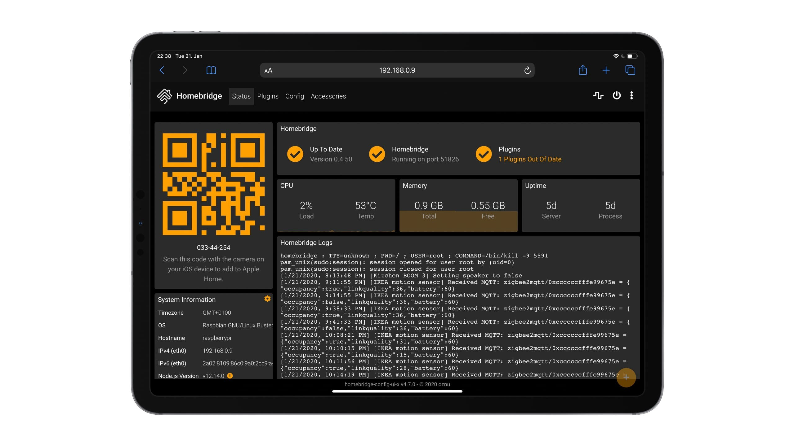
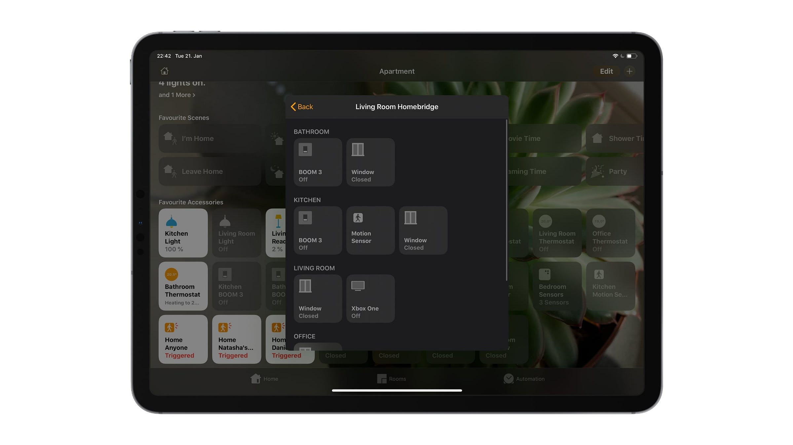
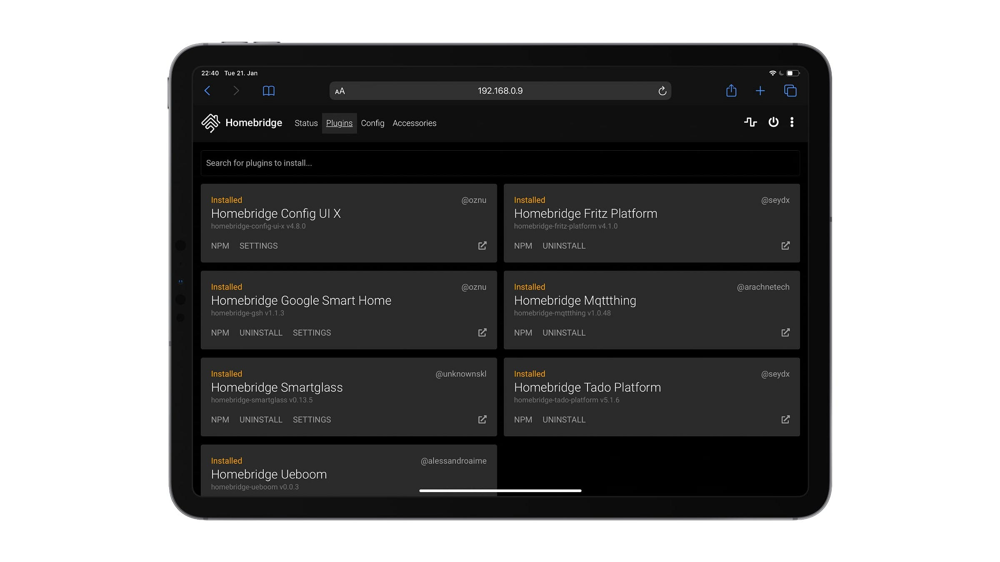

I recently wrote an [article](https://dmarcinkowski.pl/blog/how-i-automated-my-flat-using-apple-homekit-and-google-home/ "How I automated my flat using Apple HomeKit and Google Home") where I gave an overview of my current smart home setup. There, I briefly mentioned that I’m using Raspberry Pi with a Homebridge server running on it. In this piece, I’d like to explain my setup in more detail.

For starters — my knowledge about programming, Linux, etc. is close to zero. To get most of the things mentioned below to work, I just went through dozens of different tutorials, articles, and Github repositories. I will try to link all of them so that you can achieve similar outcomes.

<figure>

<figcaption>

GUI of Homebridge

</figcaption>

</figure>

### Raspberry Pi and CC2531

If you would have told me a year ago that I’d buy a Raspberry Pi, I’d probably say something like _oh no, I don’t really have time for something like that, I’d rather get a ready-to-go-solution_. But, after months of my dad encouraging me and talking about its capabilities/possibilities, I went for the **Raspberry Pi 4 Model B with 1 GB of RAM**.

To be completely honest — I have no idea what’s the best Raspberry Pi to handle home automation. I don’t really use the full capacity of mine yet, but I’m thinking about using it as a networked Time Machine backup besides having just a Homebridge server on it. I believe that Raspberry Pi Zero W should be able to run Homebridge as well (as I read in a few tutorials), but please, don’t quote me on that. For me, the deciding factors were USB 3, Bluetooth LE, and Gigabit Ethernet.

Thanks to my dad, I also have a **CC2531 USB stick** — it allows you to connect Zigbee devices to Raspberry Pi or another computer — so, no bridges from manufacturers needed. Mine already had [Zigbee2MQTT](https://www.zigbee2mqtt.io/) flashed, which is required to be able to talk to/communicate with Zigbee devices.

<figure>

<figcaption>

Devices connected to my Homebridge

</figcaption>

</figure>

### Homebridge and non-compatible devices in HomeKit

I was quite curious to try out [**Homebridge**](https://homebridge.io/) since I read quite a lot about it on Twitter and heard it being mentioned in podcasts such as [Connected](https://www.relay.fm/connected). It’s a piece of software that allows you to add non-compatible devices to HomeKit or, like in a case I’ll return to later, expand the compatibility of already-supported devices. I’m using it with a [GUI](https://www.npmjs.com/package/homebridge-config-ui-x) that makes it much simpler to install plugins and configure new accessories.

I started off with installing a [plugin](https://www.npmjs.com/package/homebridge-ueboom) that allows me to turn on our **UE BOOM 3** Bluetooth speakers. That’s literally all that the plugin does, but it’s enough for me to be able to include the speakers in HomeKit automations.

Soon after that, I learned about a [plugin](https://github.com/oznu/homebridge-gsh) that exposes devices from Homebridge to **Google Home**. At first, the speakers mentioned above kept disappearing from the Google Home app, but at some point, it just started working.

Next, I wanted to make use of the CC2531 stick and make **IKEA Trådfri motion sensor** compatible with HomeKit. For that, I installed an [MQTTThing plugin](https://www.npmjs.com/package/homebridge-mqttthing), which is compatible with Zigbee2MQTT. After digging a little, figuring out the sensor’s ID with MQTT Explorer app, and repurposing a config for Hue motion sensor I found on the plugin’s wiki, I managed to connect the sensor to Homebridge. It sounds easy, but I was close to tears after a week or so of trying — and finally succeeding. HomeKit recognises it as an occupancy sensor. It works perfectly fine most of the time, but I had to move Raspberry Pi away from IKEA’s gateway to avoid signal interference.

So far, IKEA’s sensor is the only device that I added using the CC2531 stick, but I ordered **Xiaomi Single Switch (UPDATE:** [**got it already**](https://dmarcinkowski.pl/blog/phone-free-bedroom-in-a-smart-home/ "Phone-Free Bedroom in a Smart Home")**) t**hat I will try connecting next. I was thinking about connecting all of my IKEA light bulbs and controllers using the stick too, but for now, I’m happy how they work using IKEA’s own gateway.

<figure>

<figcaption>

Plugins tab in Homebridge

</figcaption>

</figure>

The next plugin I installed was [**Tado Platform**](https://www.npmjs.com/package/homebridge-tado-platform) that exposes a few additional features of tado° thermostats to HomeKit. It adds additional modes to the thermostats (Heat, Cool, Auto, and Off vs native Heat and Off), adds battery level to Smart Radiator Thermostats, displays built-in humidity and temperature sensors as separate devices, and much more. Since I’m quite happy with how the thermostats work using tado°’s bridge, I only use two features of the plugin:

- Window sensors: each thermostat is also displayed as a contact sensor (based on tado°’s notifications that are triggered when humidity and temperature drop drastically)

- Occupancy sensors: every device registered in tado°’s app is visible as an occupancy sensor. Additionally, you can add an “Anyone” sensor (based on tado°’s own geofencing)

The latter one is something that I’m especially thankful for. Since my girlfriend doesn’t have an iPhone, we can’t use HomeKit automations based on who is at home, but using tado°’s geofencing as a HomeKit sensor allows me to kind of overcome that. We still can’t run automations based on if my girlfriend or I are home, but we have scenes like _I’m Home_or _Leave Home_ being triggered based on our location.

The last plugin I installed is the [Smartglass plugin](https://www.npmjs.com/package/homebridge-smartglass) that makes it possible to add an Xbox One to Homebridge as a TV. It’s even possible to add games and apps as input methods! I also want to install the [HDMI CEC plugin](https://www.npmjs.com/package/homebridge-tv-cec) to be able to control the TV itself using HomeKit soon — I’m only missing an HDMI cable for my Raspberry Pi.

### Try it yourself!

If you’d like to get into Homebridge too, but it seems a bit too complex for you — don’t worry. There are a lot of people and resources out there that will make it easy for you to understand how to set everything up. In the end, it’s a bit of work but allows you to expand your HomeKit setup to another level. Thousands of home appliances and other devices probably will never be supported by Apple, so if you find something in Homebridge’s plugin catalogue that you own, I’d highly recommend looking into it.
