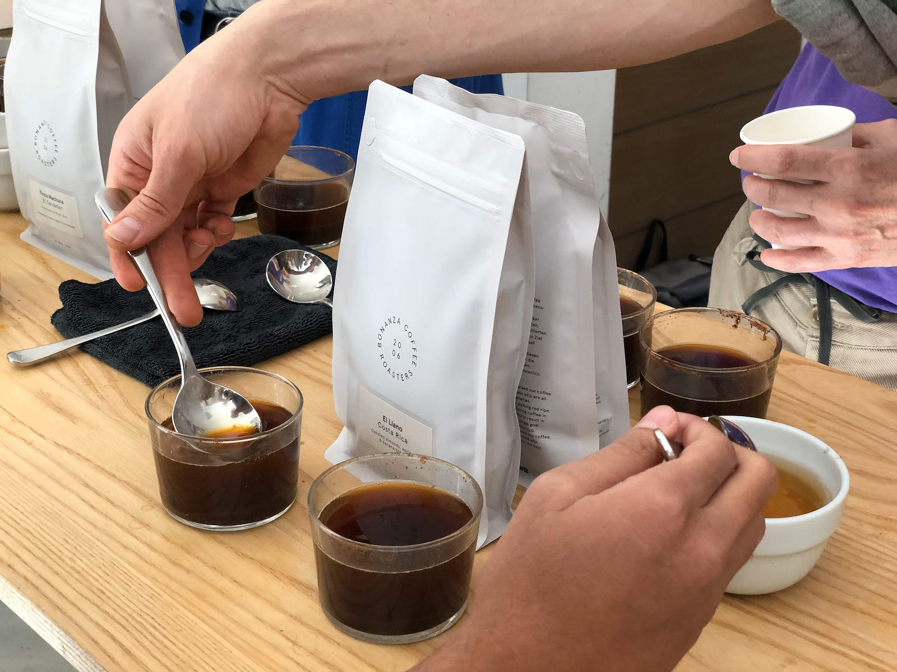
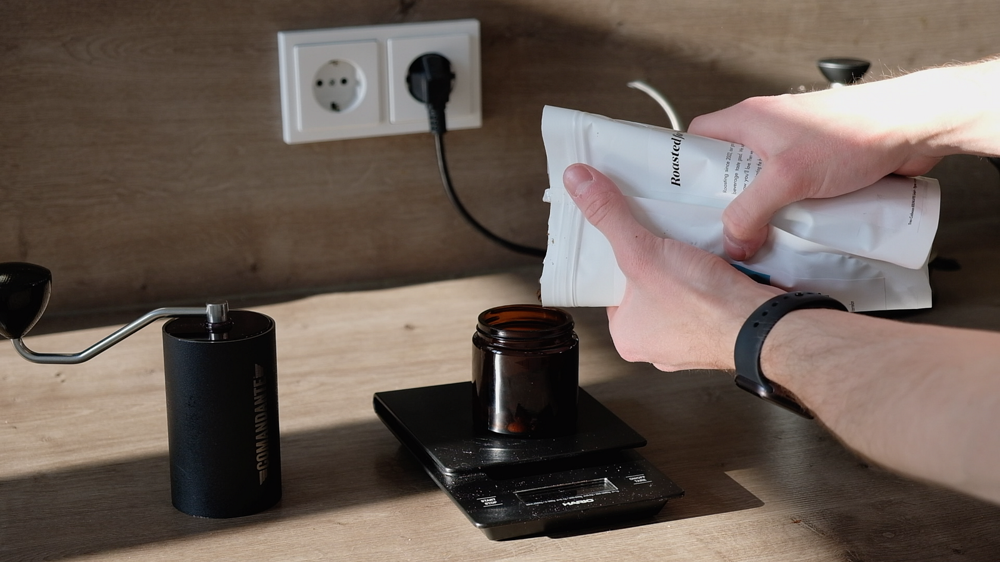
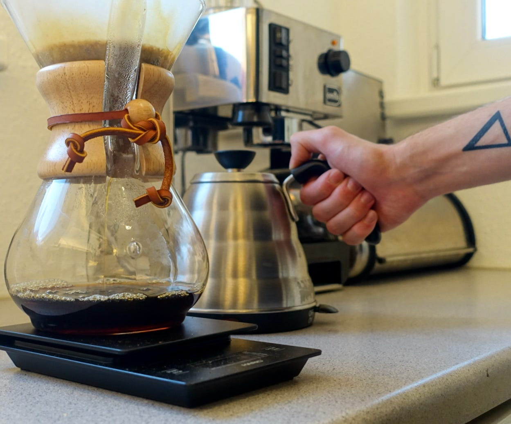
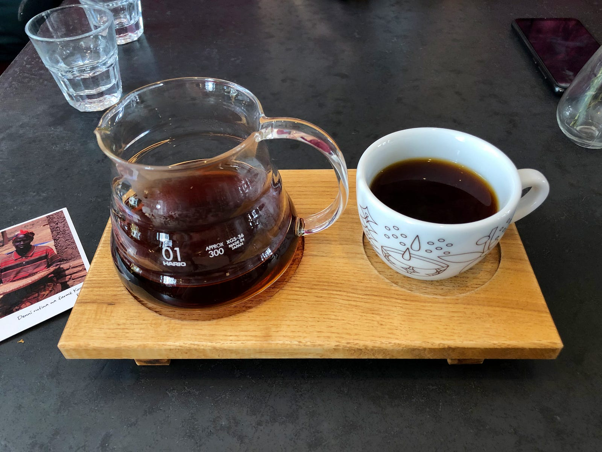
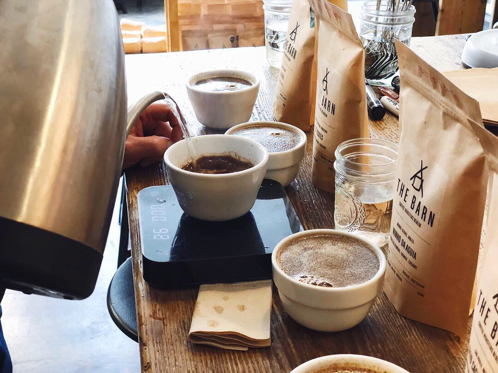
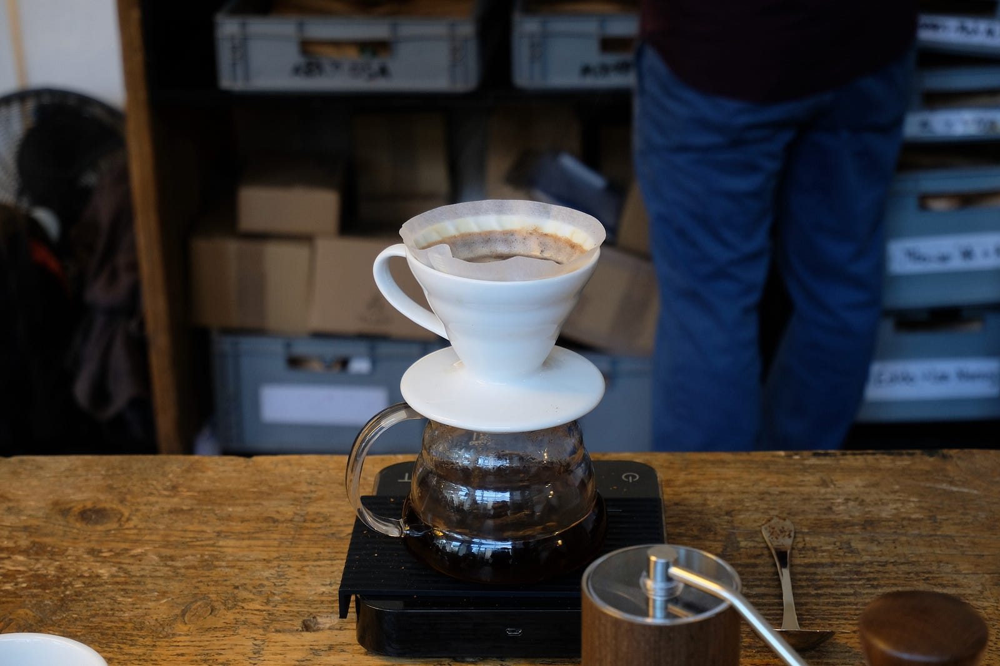
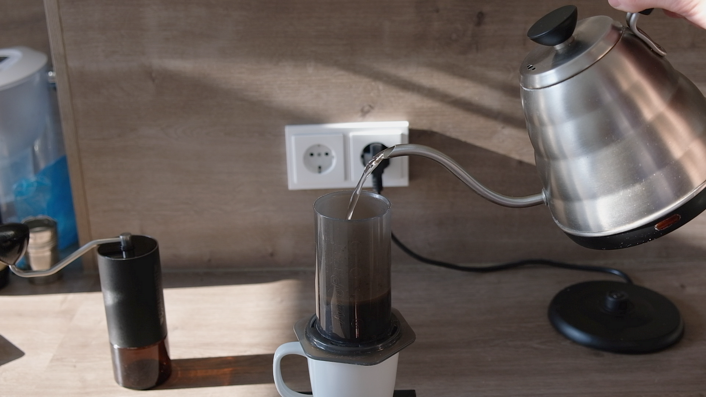

The internet is being flooded with content on working remotely and setting up a workspace at home. But there is one thing that all the publications are missing out — coffee. For most people, a mug of this heavily-caffeinated liquid is their way to start off the day. It’s no different for me. Working from home may mean that you’re cut off from an office coffee machine. Going out to a local cafe may also be risky, as you’re exposing yourself to contact with other people. So, why not try brewing coffee at home? And I mean _brewing_ — not using instant coffee, but real coffee beans. Maybe even the same ones that are used by your local baristas. Here’s how I brew my coffee at home!

* * *

**I also made the video on the same topic. Be sure to check it out and subscribe to my** [**YouTube channel**](https://www.youtube.com/channel/UCdzHWCrU8_qXmArZqwpxsXQ)**:**

https://www.youtube.com/watch?v=UylsydmgSI4

* * *

### Beans

<figure>

<figcaption>

Photo courtesy of the author

</figcaption>

</figure>

Before we get into brewing itself, we need some beans. I’m an advocate for lighter roasts that work great for filter coffee. If you’re more into a _stronger_ flavour profile, you could look into darker roasts. There is also a medium/omni-roast that sits somewhere in the middle.

The best place to get your beans from is your local roastery. I’m lucky to be living in Berlin which is full of them, including some famous ones, such as [The Barn](https://thebarn.de/), [Five Elephant](https://www.fiveelephant.com/), and [Bonanza Coffee](https://bonanzacoffee.de/wordpress/). If you also live on the Old Continent, be sure to check out [European Coffee Trip’s website](https://europeancoffeetrip.com/city-guides/) — they’ve listed most of Europe’s roasters as well as coffee places.

Since going out may not currently be an option, you can look for a roastery that offers delivery. In Berlin, most of them do. You can also try online coffee stores that offer a wider selection of roasteries, such as the Polish [Coffeedesk](https://www.coffeedesk.com/). There are even subscription services like [Bean Bros](https://beanbros.co/) that feature coffees from European roasteries. It’s pretty likely that your local stores offer similar services.

To pick the right beans to match your flavour preferences, you should either talk to a barista for a recommendation or read the profile on the bag. Most of the roasters also have a bit longer description on their websites as well. Some even have a brewing guide for a particular coffee that can help you get the most out of it. Feel free to experiment with new origins or even order a testing set. It’s the best way to discover what the coffee world has to offer.

The last important thing about beans is that you need to grind them to brew the coffee. If you don’t have a grinder at home and you don’t want to get one, ask the barista to do it for you. And if you’re ordering online, make sure to either select the _ground_ option in the order (I know for sure that [Coffee Circle](https://www.coffeecircle.com/) and [19grams](https://19grams.coffee/de/) from Berlin offer it) or add a note to the order.

### Equipment

The espresso machines and grinders that you see in coffee places are usually very expensive. We are talking a small car here. Maybe even a new car. But you don’t need any of that to make a nice cup of coffee at home!

#### Grinder

<figure>

<figcaption>

Photo courtesy of the author — [frame from my video](https://youtu.be/UylsydmgSI4)

</figcaption>

</figure>

As I mentioned earlier, you can get the coffee ground, but I strongly encourage you to grind it at home, just before brewing. Why? This way, you’re going to preserve all the coffee’s flavour and you will be able to use it within a longer timespan. I usually buy beans that were roasted a week or two ago and a single 250g bag lasts me for 2 weeks, or around 15 cups of coffee.

My recommendation is to get a grinder with steel burrs. They don’t wear down as quickly as the ceramic ones, thus they are much better in terms of grind size consistency, therefore you will be able to achieve the same results every time you brew coffee. I’m using one of the best manual coffee grinders out there, the Comandante MK3, which is often compared to the Mahlkönig EK43 that you can often find in coffee shops. But you don’t need to spend that much. I highly recommend watching [James Hoffmann’s video](https://www.youtube.com/watch?v=dn9OuRl1F3k) on entry-level hand grinders.

When it comes to electric grinders for home use, there are actually a lot of good and affordable options to choose from, such as the Baratza Encore or Wilfa Svart. If you don’t mind spending a bit more, there is also the Wilfa Uniform, made in collaboration with one of the best baristas in the world, Tim Wimbledon.

#### Scale

<figure>

<figcaption>

Photo Credit: [Slawek Agata](https://twitter.com/slawekagata)

</figcaption>

</figure>

For the best results, you have to be quite precise when brewing coffee, so using a scale is _almost_ a must. It allows you to assure that you use the right dose of beans and water for brewing. Dedicated coffee scales, like the one from Hario that I’m using, feature a stopwatch so that you don’t need a phone to measure the brewing time. There are also smart coffee scales, but you don’t really need one, especially if you’re just starting off.

#### Brewer

<figure>

<figcaption>

Photo courtesy of the author

</figcaption>

</figure>

The most important piece of the coffee-brewing puzzle is the brewer itself. I will focus exclusively on the ones dedicated to filter coffee, as they are much cheaper than any good espresso machine. But no worries — I also have something for the espresso-lovers out there!

The most basic way to brew coffee at home is to use a pour-over dripper. The most popular options out there are Hario V60, Kalita Wave, and Chemex. Besides the dripper itself, you will also need a server to brew the coffee into and, well, serve the coffee in. Every Chemex is already a decanter since you put the paper filter right onto the glass. In the case of V60, I have been using Hario’s Decanter for more than 2 years now, and I’m a huge fan.

The other option that’s quite affordable is the AeroPress, that I like to explain to people as a _coffee plunger_. Thanks to its super simple build, it allows you to brew a coffee right into a cup, simply by pressing it. The inventor of the AeroPress says that it allows you to brew espresso-like coffee at home, but I’d say it’s much closer to a filter coffee.

But, there is an accessory for the AeroPress that brings the statement much closer to reality — the Fellow Prismo. Thanks to a very fine metal filter and a (pressure) valve, it makes it possible to generate much greater pressure in the AeroPress’ chamber, so you can brew coffee that comes quite close to espresso. I have been using it for a few weeks now and, so far, I’m impressed.

#### Kettle

<figure>

<figcaption>

Photo courtesy of the author

</figcaption>

</figure>

If you’re planning on brewing coffee using a Chemex or V60 dripper, you should look into gooseneck kettles. They allow you to precisely pour water onto the ground coffee so that it brews at a consistent level. Also, they look really cool! I have been using Hario’s electric Buono kettle for over 1.5 years and I’m really happy with it. I went for the one without temperature control. The holes on top of the lid are perfect to fit a food thermometer, though!

If you are planning on using an AeroPress, you won’t need a special kettle. You can also get something like Gabi Master — version A is a Kalita-like brewer, and the version B sits on top of most of the coffee drippers, including Chemex, V60, and Kalita Wave.

### Brewing

I hope I didn’t make you spend too much already! But even if you did, this part will make it worth it — let’s brew some amazing coffee. I’m going to cover Hario’s V60 and the AeroPress as that’s what I’m using at home and they are one of the most affordable options out there. Also, for all the coffee geeks out there — I made the guides a bit simpler to avoid confusing some people.

#### V60

<figure>

<figcaption>

Photo courtesy of the author

</figcaption>

</figure>

Drippers from Hario allow you to brew for a few cups of coffee. Be sure to adjust the amount of water and coffee accordingly!

1. Boil water to 100°C

3. Grind 15 grams of coffee (the ratio should be 6 grams per 100 grams of water) at a medium-coarse size (I use 20–21 clicks on the Comandante grinder)

5. Put the paper filter into the dripper and pour water over it (it gets rid of the paper-like taste and warms up the dripper). Pour the water out afterwards

7. Pour the ground coffee into the filter

9. Put the server with the dripper on top onto a scale

11. Start a stopwatch and pour 30–40 grams of water (or double the amount of coffee). Make sure all the grounds are covered

13. Wait 30 seconds, pour 100 grams of water and wait another 30 seconds. Repeat until you hit 250 grams (or more)

15. Wait for the coffee to drip and stir at the end

#### AeroPress

<figure>

<figcaption>

Photo courtesy of the author — [frame from my video](https://youtu.be/UylsydmgSI4)

</figcaption>

</figure>

There are two ways to brew coffee in the AeroPress — classic, and inverted. Again, to simplify the guide, I will cover just the first one.

1. Boil water to 100°C, although it’s totally fine to brew with AeroPress even at 80°C

3. Grind 15–16 grams of coffee at a medium-coarse size (I use 19–20 clicks on the Comandante grinder)

5. Put a paper filter into the basket of an AeroPress and screw it onto the brewing chamber

7. Put the chamber onto a mug and pour water into it. Pour the water out afterwards

9. Pour the ground coffee into the chamber

11. Start a stopwatch and pour 100 grams of water. Stir 5 times. Wait until 30 seconds

13. Wait until 30 seconds and pour the rest of the water (until 250 grams

15. Put the plunger into the chamber

17. Press the coffee at 1 minute and 10 seconds

* * *

I hope that after this article you will be having much better coffee at home. And remember — support your local roasteries to help them get through this hard period. Stay safe!
