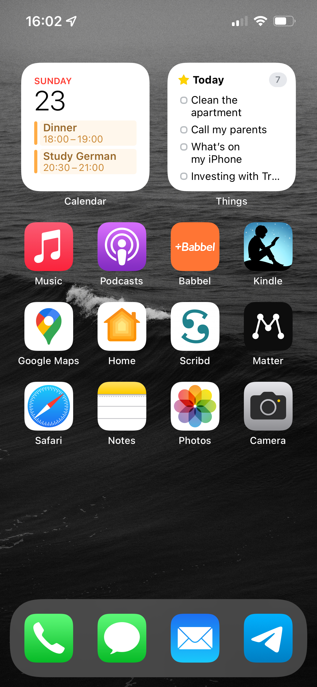
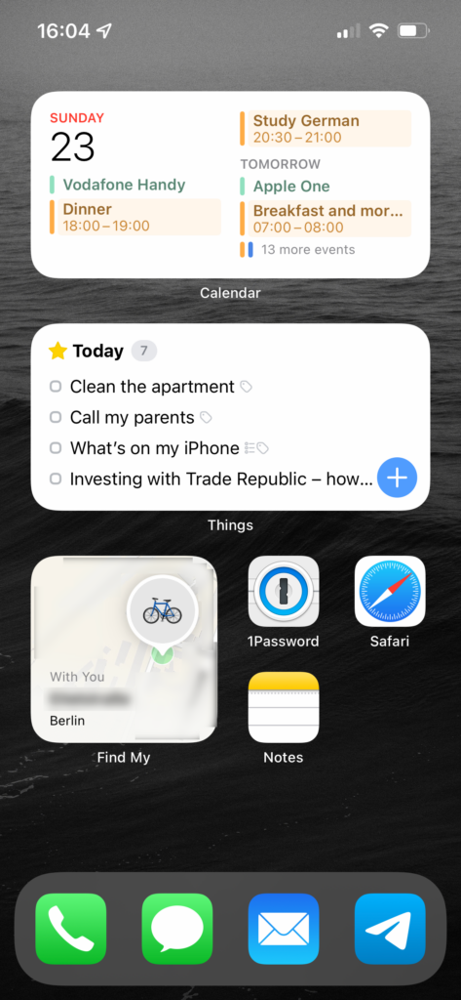
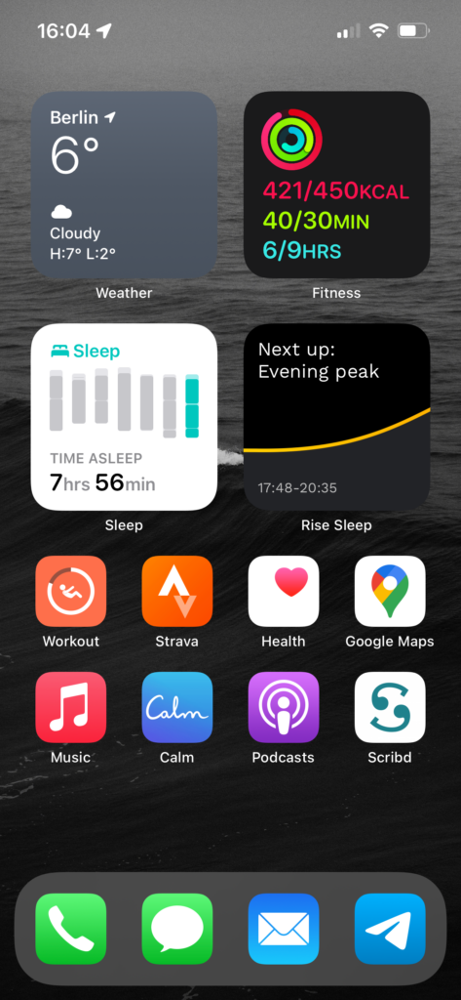

This series became a small tradition for me. I have been documenting what’s on my homescreen for the past three years (read the [2019](https://dmarcinkowski.pl/blog/my-iphone-homescreen-2019), [2020](https://dmarcinkowski.pl/blog/my-iphone-homescreen-2020), and [2021](https://dmarcinkowski.pl/blog/my-iphone-homescreen-2021) installments). Every time, I’m surprised how much I changed my setup. It’s not different this year.

But first — a hardware update. I finally switched from iPhone X to iPhone 13 Pro — and I love it. I preferred X’s dimensions and weight (13 Pro is a small brick), but the new camera system with Macro mode and the ProMotion display sold the new iPhone for me.

### Main homescreen

I feel like ever since Apple introduced homescreen widgets, I couldn’t find a configuration that I was 100% happy with. This still holds true, but I get a lot of use out of apps and widgets that I picked.

The top of the homescreen is reserved for **Calendar** and **Things** widgets. I stopped using stacking widgets and Smart Rotate — I didn’t find having even more widgets useful.

I still use **Apple Music** and **Apple Podcasts**, and I’m not looking to switch from either of them anytime soon. I just wish Amazon added support for AirPlay 2 to the Echo speakers.

Even after being stuck at home for the past two years, I didn’t pick up much German. But with **Babbel,** I feel like I’m making some real progress, especially compared to Duolingo. Why would I want to learn how to say “I met with my elephant in a park” in German?

At the end of last year, my girlfriend encouraged me to give audiobooks a shot and recommended the **Scribd** app. Think of it as Spotify for audiobooks and more. They have many positions on my reading list, like _The Innovators_, _Never Split The Difference_ or _Shoe Dog_. I will keep my subscription on for the next few months. You can [try it our for free for two months](https://www.scribd.com/g/9m4i41) using my referral link.

I first read about **Matter** in [M.G. Siegler](https://medium.com/u/5c6977d2a94f)’s [own iPhone homescreen overview](https://500ish.com/looking-back-at-my-2021-homescreen-6e226f105bc7) (he was an inspiration when I started this series). It’s a more social alternative to Instapaper or Pocket. Since recently, it even supports exporting to Kindle. I’m going to keep using it for a while and see if it sticks. Otherwise, I will go back to Instapaper, which works great for me. You can [follow me on Matter](https://getmatter.app/dmarcinkowski/).

As you can see, **Google Maps** is still on my homescreen, which means that there are still no cycling directions in Apple Maps in Berlin. Apple, please.

### Focus pages

In iOS 15, Apple introduced Focus modes. I wrote an [article](https://dmarcinkowski.pl/blog/focus-is-the-best-new-feature-in-ios-15-heres-how-i-use-it-d3b1202b338b) about how they work and how to set them up. The biggest advantage of Focus modes are custom home screens that activate based on the time, location, app in use, etc. I have been experimenting with Focus modes myself to create a few activity-focused home screens.

<figure>

<figure>

<figcaption>

Work page

</figcaption>

</figure>

<figure>

<figcaption>

Fitness page

</figcaption>

</figure>

</figure>

#### Work page

My Work Focus mode automatically activates when I arrive at my office or between 9AM and 5PM when I’m working from home. Since I don’t have to use my phone for work, the Work homescreen is pretty simple, and it’s mostly about the Calendar and Things widgets. I find it a great way to stay focused and limit distractions.

I also use the Find Me widget that shows the location of an AirTag attached to my bike. It calms down my anxiety about having my bike stolen (a big issue in Berlin).

#### Fitness/Morning page

I also have a dedicated homescreen for the Fitness Focus mode, which doubles as a _morning mode_. It gives me a quick overview of my sleep (I track my sleep with an Apple Watch) and tells me what’s the weather like. I’m currently using the **Rise** app, which gives me more detailed insights into my sleep quality and energy levels throughout the day.

As for the app icons, it’s just more health-related apps (that I change every once in a while) and my standard set of multimedia apps together with Calm for meditation.
