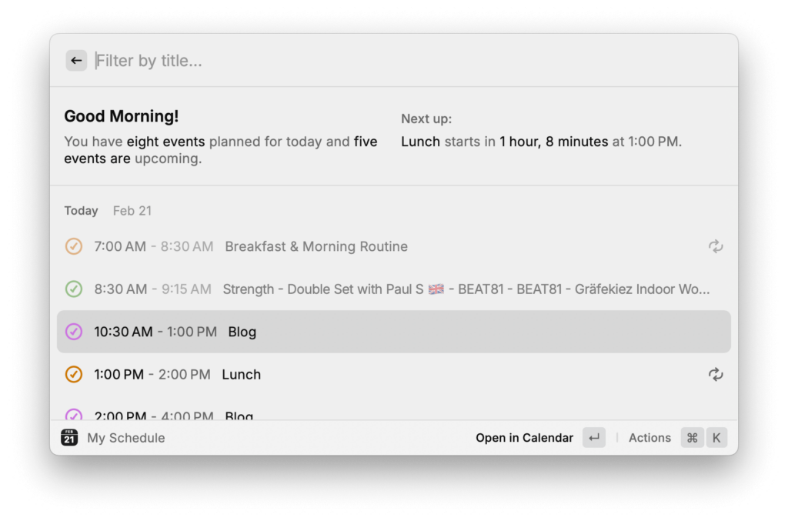
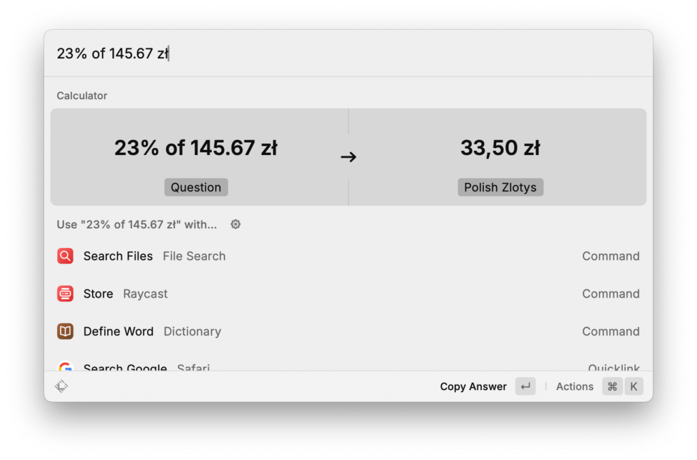
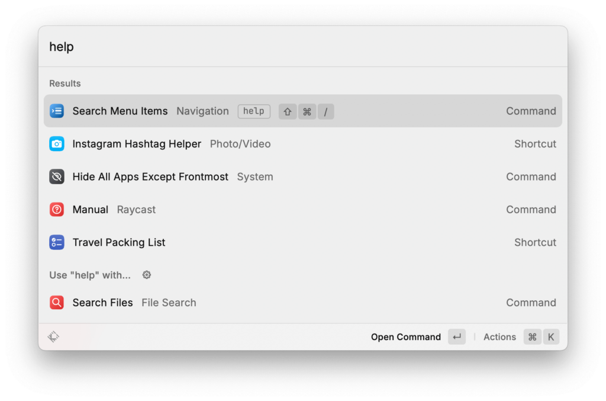
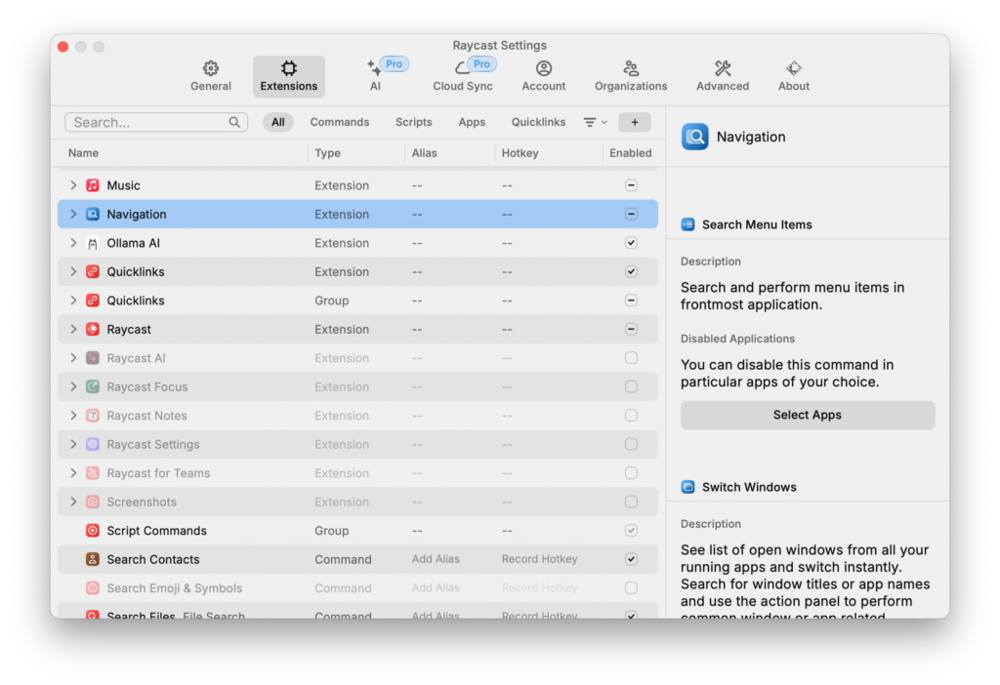
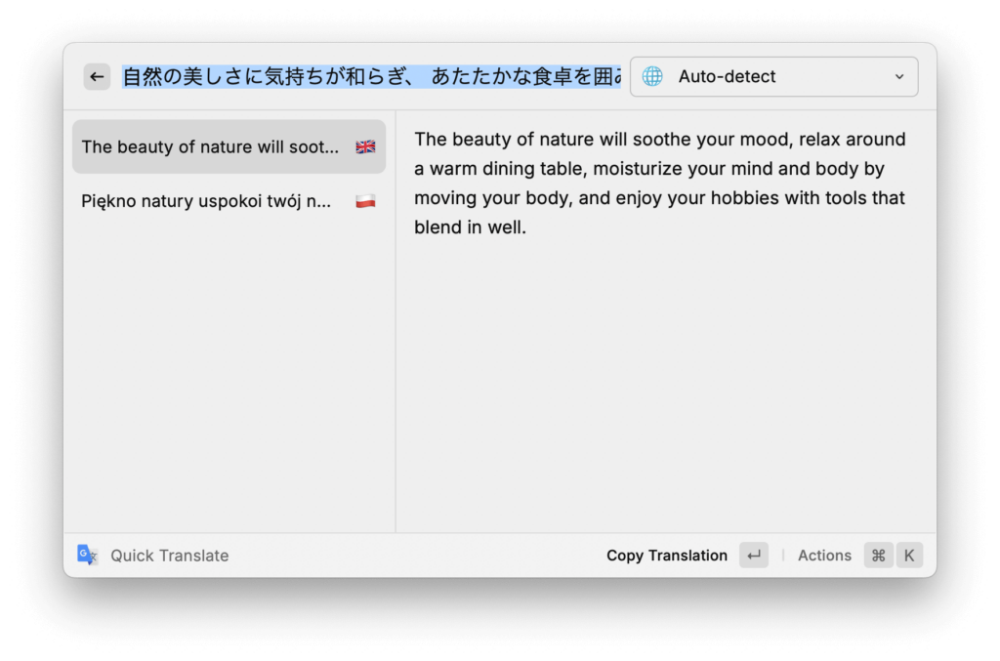

Since the beginning of this year, I have been re-evaluating most of my productivity tool stack. In some cases, like with [Apple Notes](https://dmarcinkowski.pl/blog/why-i-chose-apple-notes-with-forever-notes-over-obsidian-and-notion/), I ended up sticking to the app itself but radically changing how I use it. In other cases, like with macOS’ built-in Spotlight search, I replaced it completely with an alternative that better fits my workflow. That alternative is [Raycast](https://raycast.com/?via=daniel-marcinkowski).

## The Out-Of-The-Box Raycast Experience

There is no better way to describe what Raycast is than just to call it a super-charged alternative to Spotlight. Raycast takes almost every feature built into Apple’s native global search, greatly expands it, and wraps it in a more customizable and beautiful package. Take calendar events as an example — Spotlight does let you look up past and upcoming events by their name, but Raycast gives you a complete overview of your schedule and even lets you take actions like joining video calls.

<figure>

<figcaption>

Calendar extension

</figcaption>

</figure>

Another great example of Raycast’s built-in capabilities is its Calculator extension, which works in a similar way to Spotlight, but also lets you use natural language to perform calculations. If your math proficiency is as bad as mine, I’m sure you will love it.

<figure>

<figcaption>

Calculator extension

</figcaption>

</figure>

There are other extensions offered by Raycast out-of-the-box that made using my Mac significantly more convenient. Search Files, for example, works much faster than Spotlight and allows me to preview files without entering into Quick Look. [Quicklinks](https://ray.so/quicklinks/file-system) are an advanced feature that I didn’t fully grasp just yet. On a basic level, they work like Quick Website Search in Safari or DuckDuckGo’s !Bang shortcuts, allowing you to search on specific websites and apps directly from the Raycast window.

## Aliases and Hotkeys

I also have to mention hotkeys and aliases. If there’s a feature that you access particularly often, you can assign it an alias to make it easier to search for or a global hotkey so that you can access it from anywhere in macOS without ever launching the Raycast window. I use `Option-Command-\` to open the Passwords app and `Shift-Command-/` to trigger the Search Menu Items command from the Navigation extension.

<figure>

<figcaption>

Alias and hotkey

</figcaption>

</figure>

## Tweaking Raycast For My Needs

These are just a handful of extensions and features that Raycast offers right after you install it. And frankly, there are so many of them that I found the app quite overwhelming when I first used it a few years ago, making me stick to Spotlight for its simplicity. But when I installed Raycast again a few weeks back, I spent a good amount of time tweaking its settings and disabling extensions, commands, and search results I won’t need. When I was done, I was left with a far more focused setup that still lets me use a relatively small portion of Raycast’s features that I quickly got used to relying on.

<figure>

<figcaption>

Raycast settings offer a ton of customization options

</figcaption>

</figure>

## Raycast Pro

If you want even more features, though, Raycast also offers a Pro subscription at $8/month ($10 when billed monthly). It gives you access to their AI assistant, Cloud Sync, advanced window management features, custom themes, and more. I’m on the free version as it has everything I need, but I would see myself upgrading to the Pro plan if I were to use multiple Macs again.

## Third-Party Extensions

I still haven’t touched on Raycast’s most valuable asset – its vast library of almost 2,000 community-built extensions. They are what really makes Raycast stand out when compared to other Spotlight replacements like Alfred or Launchpad. Extensions let you search in and interact with other apps, websites, APIs, devices, and so much more. I recommend you go to the [Raycast Store](https://www.raycast.com/store) and search for whatever comes to your mind — it’s probably there.

Some of my personal favorite third-party extensions include:

- Apple Intelligence: access Apple’s Writing Tools without having to go through the `Control-Click` menu;

- Google Translate: translate to multiple different languages at the same time;

- Messages: send texts, navigate through history, and paste 2FA codes in third-party browsers;

- Ollama AI: talk to locally-hosted LLM models;

- Things: use the Things 3 app, including adding new tasks or projects and showing content of tasks lists;

- TinyPNG: compressing and resizing images;

- Weather: adds option to lookup weather info, which Raycast doesn’t provide out-of-the-box.

<figure>

<figcaption>

Google Translate extension

</figcaption>

</figure>

Raycast has built a handful of its own extensions, like one for Apple Reminders, which lets you create and manage reminders without ever opening Apple’s app, or Google Workspace for accessing Google Drive files.

## Try Raycast Yourself

At first, I was really intimidated by Raycast’s massive list of features and extensions. But after taking some time to tone it down a bit by disabling everything I don’t need, I realized just how useful it can be. Almost every day, I catch myself using more and more of the features I have left on, and even adding some more extensions from the Raycast Store. Just today, I have installed the Toggl Track extension to control my timers.

If you have never tried [Raycast](https://raycast.com/?via=daniel-marcinkowski), I recommend you install it and give it at least a week to see how it fits your own workflow.
