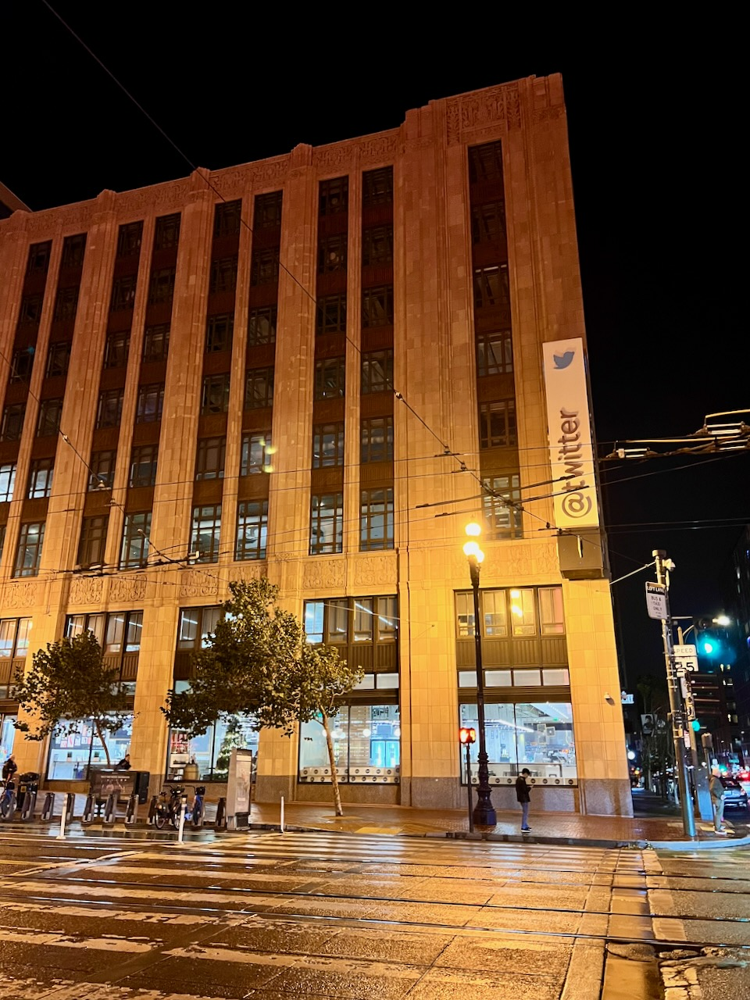

Long story short: I'm leaving Medium[1](#fn1-30370 "see footnote"). I didn't make this decision because I have anything against Medium itself. Sure, they have gotten quite aggressive with promoting their membership program through countless pop-ups, they still don't support Markdown, and, in general, the platform doesn't offer nearly as much customization as WordPress, Ghost, or other CMS tools. These aspects did have _some_ impact, but were far from being a deciding factor.

A few years back, I used to be quite active on Twitter (now called X). In fact, if it weren't for Twitter, I wouldn't be where I am today. I wouldn't have met many fantastic people who enabled me to kick-start a career in marketing while I was still in high school. Maybe I wouldn't work in tech at all. Maybe I wouldn't move to Berlin. I can pinpoint multiple life-changing events in my life to Twitter and people I have met on it.

What I really loved about Twitter is that it allowed me to connect with people from different communities I wanted to be a part of: the podcasters I listened to, Polish tech journalists and bloggers I hung out with, and product designers as well as app developers I aspired to be. I didn't realize this until recently, but this mix of creative people from different disciplines had a major impact on shaping who I am today and was a big inspiration in my professional work and personal projects.

As Twitter started to decline, many of the inspiring people I used to follow started to either reduce their engagement with the platform or flee completely. Around the same time, I was also deep into the cryptobro Twitter because of my work, and it has only deepened my belief that the Twitter I used to love and be inspired by is gone.

<figure>

<figcaption>

San Francisco, Twitter HQ in December 2022. RIP old buddy

</figcaption>

</figure>

I did try all of the _new Twitters_, but I'm yet to fully commit to one and rediscover the same creative inspiration I used to get. All of my favorite tech podcasters and bloggers mostly went to Mastodon. Threads has introduced text-based social media to many of my IRL friends. And Bluesky, even though it had a modest start, seems to be gaining more wind with flocks of people leaving now-X.

In many ways, Medium is going through its own decline. One of the main reasons why aspiring writers and creators joined the platform circa 2016 was its community. Regardless of what you were writing about, you had instant access to a like-minded audience. Today, many of these creators are moving away to other platforms or hosting their own sites to regain control over their audience, content, and personal branding. With this mass migration, Medium has lost its social appeal.

After I lost my community on Twitter and the creators I used to read on Medium ventured out of the platform, I felt somewhat lost. Whenever I felt an urge to share something online, I didn't know if I should go on Mastodon, Bluesky, or Threads. Frankly, I still don't know. I wasn't so keen to post on Medium, either, hence why I have barely published anything outside of my work.

But, I don't want to stay hopeless. As I mentioned earlier, I wouldn't be where I am today if it were not for Twitter and the online community I have built over the years. I don't want to give up on it completely. Otherwise, I'm worried that I will miss out on future life-changing opportunities that could come out as a result of my online presence. In many ways, leaving Medium is me hitting a reset button on how I want to present myself online. And along the way, I hope to rebuild the community I used to have on Twitter.

As for the new incarnation of my blog, I will be exploring using technology to stay creative, productive, and healthy while trying to navigate the attention-grabbing world that we found ourselves in. For someone with ADHD, fighting with distractions and impulses has never been harder, so I want to use my blog as a tool to find myself more accountable and help people who are in the same battle.

* * *

1. Well, sort of. I will continue to post on [Life After Anmeldung](https://medium.com/life-after-the-anmeldung), where I share personal finance tips with fellow expats in Germany. [↩︎](#fnr1-30370 "return to article")
