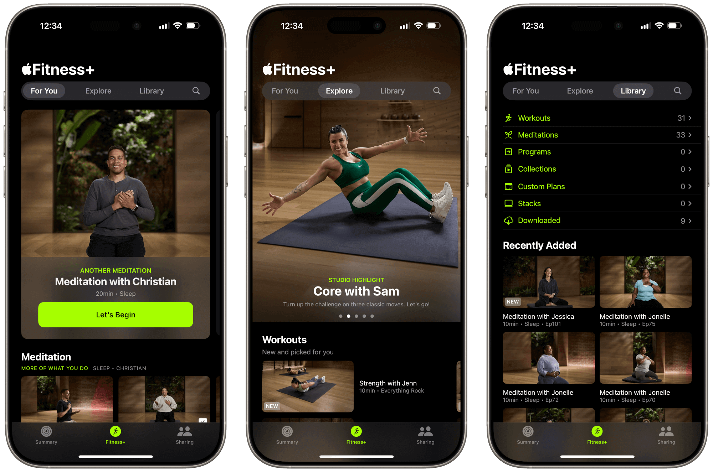
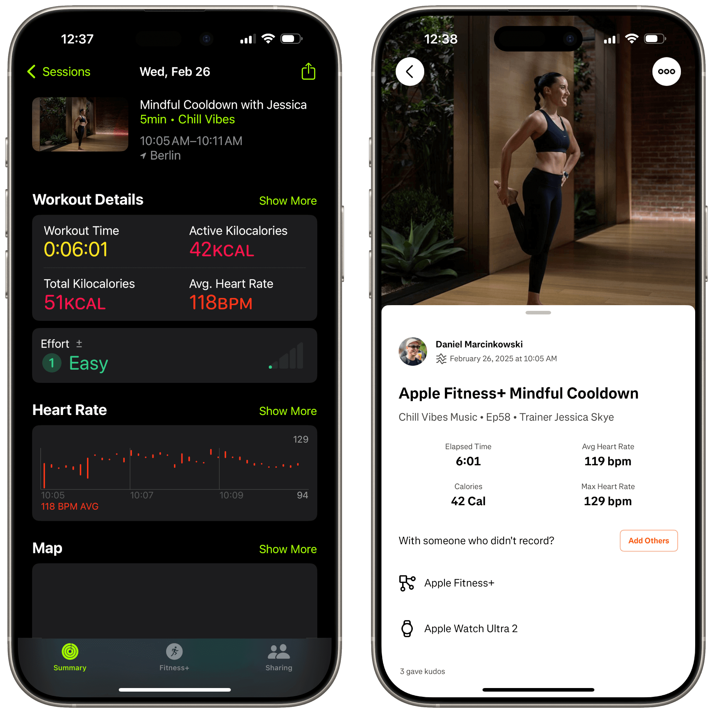
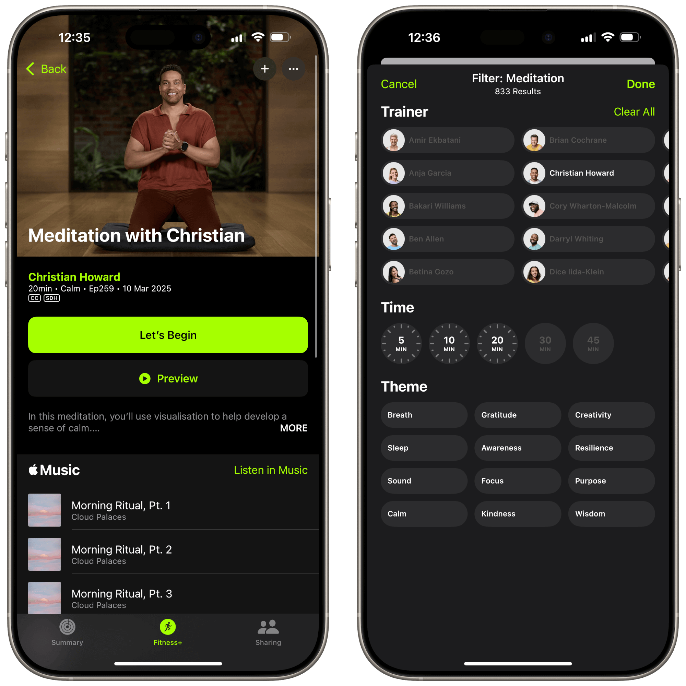
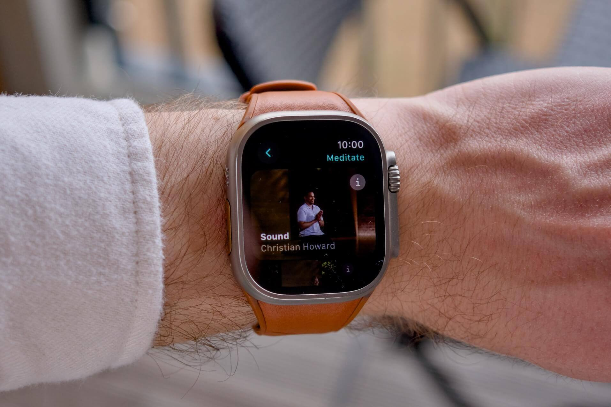
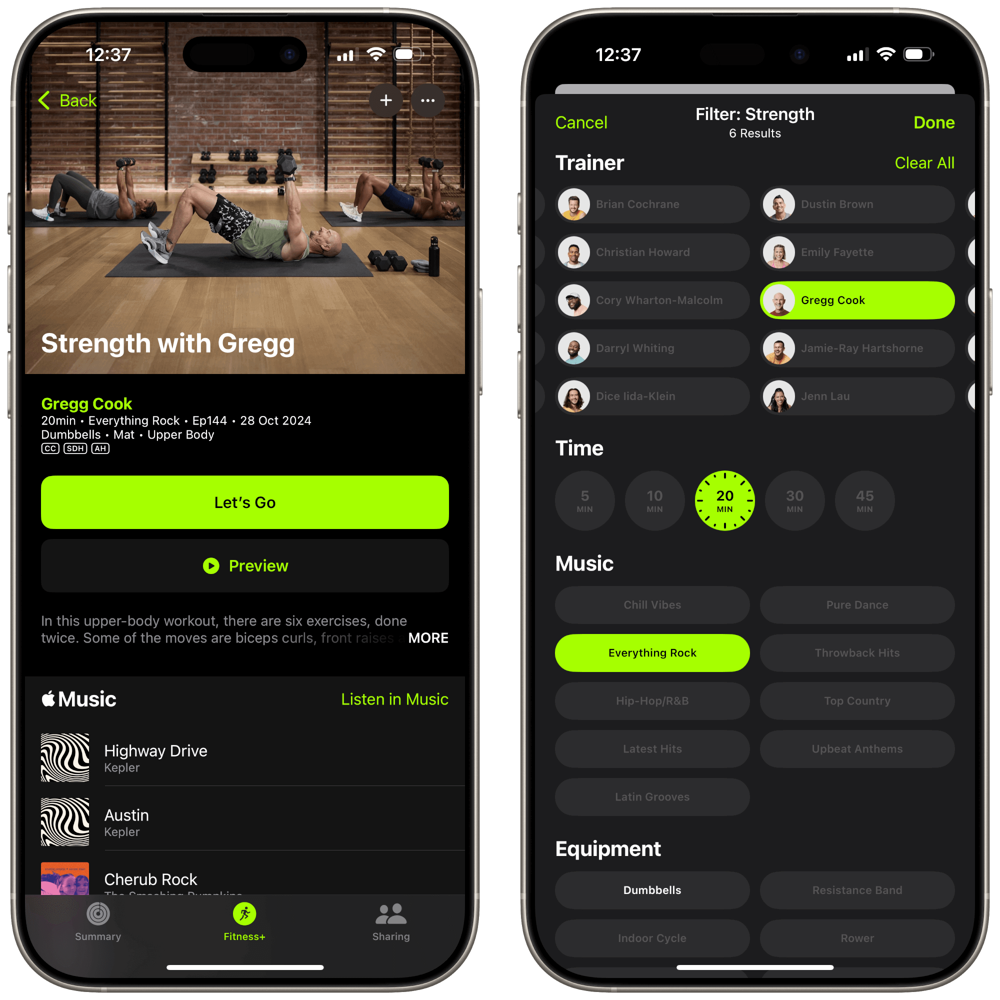
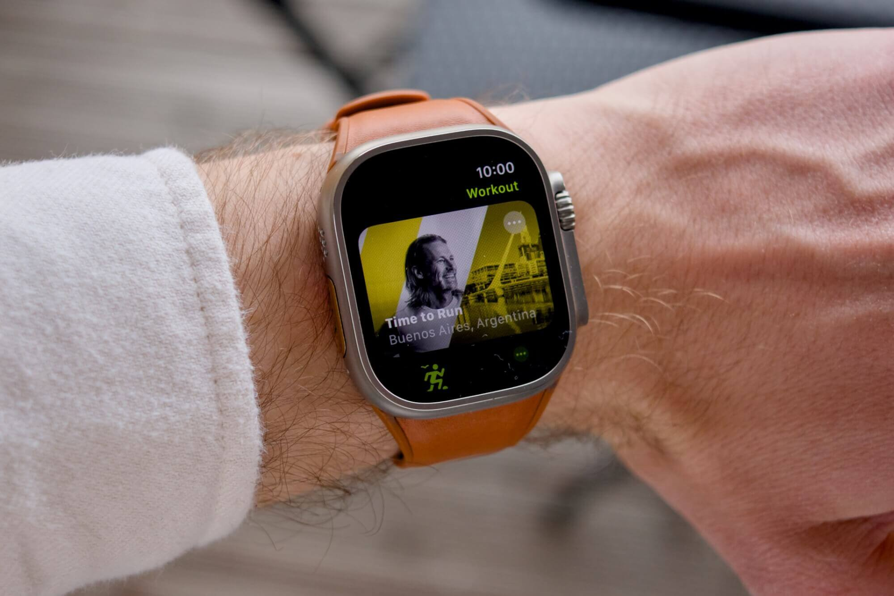

A quick glance at my blog and social media will tell you that I’m deep into the Apple ecosystem. That includes the company’s services, like [Apple Music](/blog/apple-music-revisited/) and Apple TV+. But, for the past year, I have been using another service from Apple that doesn’t seem to get quite the same level of recognition as those two: Apple Fitness+. As my family and I hit the 200 GB limit of the Apple One Family tier a year ago, I upgraded us to the Premier plan (called Premium here in Germany), enabling access to Apple’s online fitness classes. And I must admit straight away, I wouldn’t want to give it up.

<figure>

<figcaption>

Fitness+ app at a glance

</figcaption>

</figure>

## Fitness+ and the rest of the Apple ecosystem

Like with all Apple products and services, Fitness+ is deeply integrated into the company’s hardware and software. When it launched, Fitness+ required an Apple Watch, but since the Fitness app was brought to all iPhone users in iOS 16, it’s no longer the case. While you’re working out, Fitness+ will show live metrics on your device right next to the time remaining. The actual metrics vary by the type of workout, but they usually include your Activity rings, heart rate, calories burned, etc. The metrics will appear regardless of whether you’re playing the workout on your iPhone, iPad, or an Apple TV, or AirPlay to a Mac or compatible TV.

Where this hardware-software integration really shines is with Apple Watch’s ability to connect to gym equipment via GymKit. Not only does it allow the Watch to send your live heart rate to a treadmill or a stationary bike — it will also send back information about your distance, speed, RPMs, and so on. All this information is displayed for Fitness+ workouts, too. This is truly Apple at its best.

<figure>

<figcaption>

A yoga workout syncing from Fitness+ to Strava

</figcaption>

</figure>

A somewhat gimmicky but actually very motivating aspect of Fitness+ is the Burn Bar, which compares your effort to others who completed the same HIIT, Treadmill, Cycling, or Rowing workout. It really pushes me to _stay ahead of the pack_ whenever I exercise with Fitness+.

One last technical aspect worth mentioning is Fitness+’s improved sync with Strava. [Since recently](https://www.apple.com/newsroom/2025/01/apple-fitness-plus-unveils-an-exciting-lineup-of-new-ways-to-stay-active-in-2025/), Fitness+ workouts feature a nice, rich preview with the details about the class, including a thumbnail, duration, information about the coach, etc. As someone who perhaps pays a bit too much attention to how my logged workouts appear on Strava ([check for yourself](https://www.strava.com/athletes/47540494)), I found this to be a very welcomed improvement.

## Guided Meditations

I’m far from being spiritual, but taking care of my mental health is critical for me, especially in terms of coping with [ADHD](/blog/category/focus-adhd/). Without a doubt, meditation has proved to be an amazing tool in supporting my therapeutic work. The guided meditations in Fitness+ have worked particularly well for me, as I have completed over 250 sessions and counting. In the past, I have used similar services like Calm and Headspace, but I couldn’t justify their subscription price. Since Fitness+ and its Meditations come bundled with Apple One Premiere, which I would pay for anyway, I stuck with it.

<figure>

<figcaption>

Meditations in Fitness+

</figcaption>

</figure>

One of my favorite aspects of Meditations is its ability to filter through hundreds of sessions on the platform based on their duration and themes. Meditations are either 5, 10, or 20 minutes long, so there’s always an option regardless of how busy my schedule for the day is. There are 12 different themes for different situations, like Calm for feeling at ease, Sleep for winding down, and Creativity for inspiration. Breath[1](#fn1-14184 "see footnote") is the [latest addition](https://www.apple.com/newsroom/2025/01/apple-fitness-plus-unveils-an-exciting-lineup-of-new-ways-to-stay-active-in-2025/) to Meditations, and it features specific exercises to help you focus, relax, etc.

I find myself using Meditations at least a few times a week, sometimes more than once a day. They have been very helpful in restoring focus during a hectic day or relaxing before going to sleep. For the latter, I found it useful that I can access all Meditations in an audio format from the Mindfulness app on my Apple Watch. For years now, [I charge my phone away from my bed](/blog/phone-free-bedroom-in-a-smart-home/) so that I don’t reach for it first thing in the morning.

<figure>

<figcaption>

Audio Meditations on the Apple Watch

</figcaption>

</figure>

In terms of instructors, I think they are all great, but I tend to gravitate more towards Christian and Jessica. They are also the two trainers featured in the Mindfulness app on the Apple Vision Pro, which was one of my favorite uses for the headset when I got to use it for a few days.

## Workouts on Fitness+

In terms of my workout routine, when I’m home in Berlin, [I usually go to group classes](https://medium.com/life-after-the-anmeldung/getting-into-fitness-in-berlin-with-beat81-urban-sports-club-e7c7f6305c87), either for strength-focused HIIT sessions or indoor cycling. I like that I can just show up and not think about what I’m supposed to do. When I’m traveling, Apple Fitness+ is perfect to use at hotel gyms. I’d often create a _Stack_, which lets me queue a few workouts for a complete session. For example, I’d start with a 10-minute treadmill run, do a 20-minute strength workout, row for 10 minutes, and finish off with a 10-minute mindful cooldown.

<figure>

<figcaption>

Workouts in Fitness+

</figcaption>

</figure>

Similarly to Meditations, Workouts have their own set of filters so that you can target lower, upper, or whole body, specify what equipment you have available to you, and pick music genre. If you’re into rock music, Greg’s workouts are my favorite. Fitness+ also has Artists Spotlights that focus on particular musicians or bands, including Foo Fighters, Imagine Dragons, Daft Punk, and Apple’s favorite, U2.

As an amateur runner, I also use Fitness+ and its Mindful Cooldown for stretching. If I need something longer than 10 minutes, I start a yoga workout. On the topic of running, I also tried _Time to Run_ a few times. Available directly in the Workout app on the Apple Watch, these guided runs combine coaching, sort of a tour guide for iconic cities, and Apple Music playlists that often feature local artists. I did a couple of those, one for Berlin and another for Brooklyn. They can be fun, but I prefer to run to my own music.

<figure>

<figcaption>

Time To Run on the Apple Watch

</figcaption>

</figure>

Similarly, Fitness+ offers _Time to Walk_, which features stories from famous artists and actors alongside a few songs hand-picked by them. As a huge How I Met Your Mother fan, I really loved the one with Jason Segel, where he talked about his role in Shrinking (an Apple TV+ show).

## Conclusion

From all services that Apple offers, Fitness+ may not be as easy to recommend as Apple Music and Apple TV+, but it quickly became an important tool in my own health & fitness tool stack. It helped me stay consistent with meditating and allowed me to stick to my workout routine when I’m away from home. Of course, I could always use another meditation app or sit in silence, or plan my hotel gym workouts with ChatGPT. But Fitness+ removes a lot of friction, which I found to be crucial in maintaining my fitness habits. And it comes bundled with the Apple One Premiere plan I’d pay for just to get 2 TB of storage anyway. If you haven’t tried it yourself yet, I hope I motivated you to change that!

* * *

1. Not to be mistaken for the Breathe feature of the Mindfulness app on the Apple Watch. [↩︎](#fnr1-14184 "return to article")
