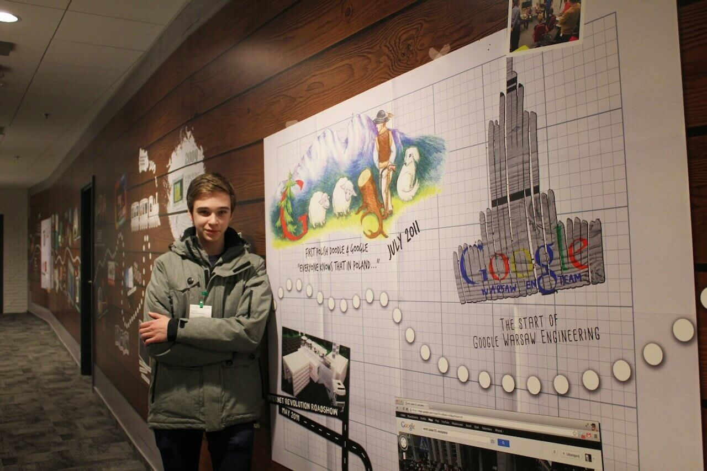
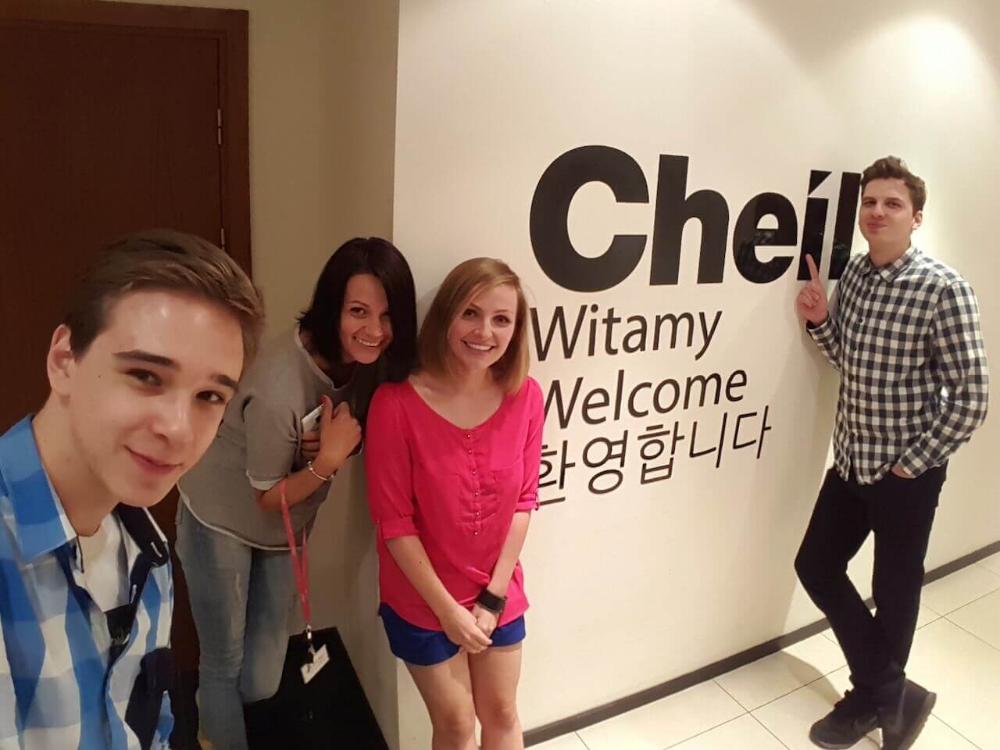
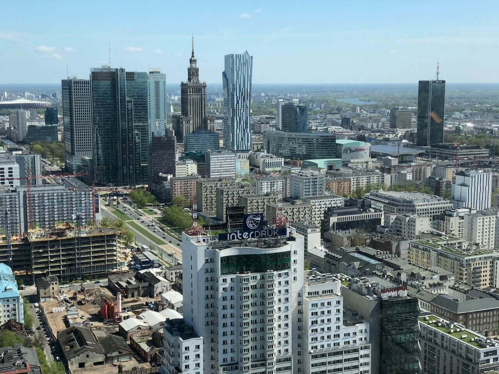
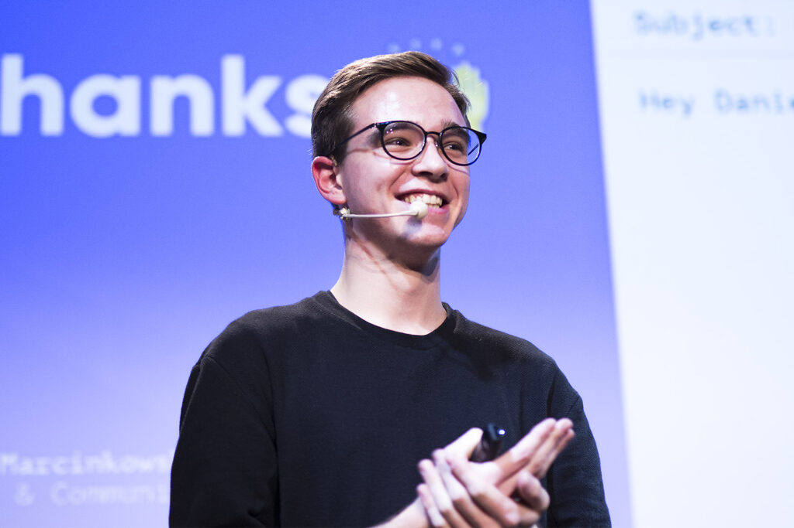
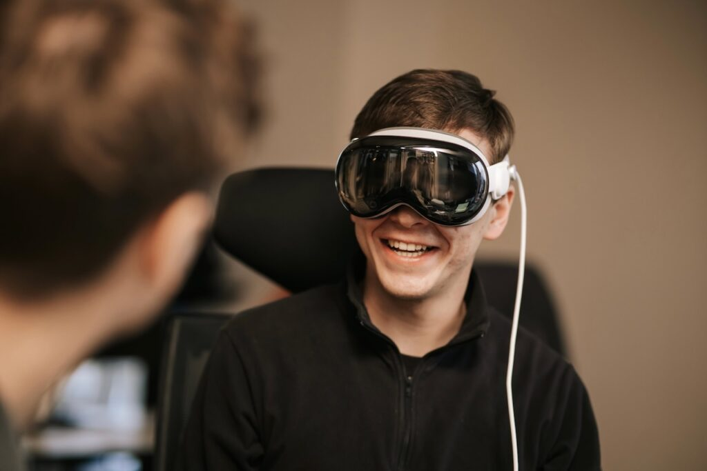
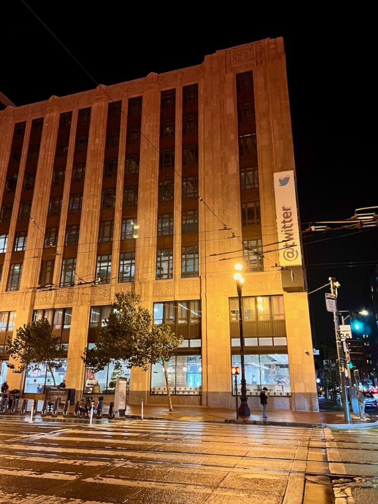

I’m about to turn 28 in a few months. Despite not having a college degree, I already have a decade of work experience on my resume. Whenever I tell someone I just met about my career path, they often raise their eyebrows. As I’m about to embark on the next chapter in my life (more on that later), I thought it might be a good time to reflect on the past ten years as someone who chose an early career start over formal higher education.

My first job experience was during my junior year of high school when I worked as an editor for [Android.com.pl](https://Android.com.pl), one of Poland’s most popular tech news sites. It was an incredible experience for a tech-loving teenager like me. I got to write about things I loved, earn some cash, and dive deep into the Polish tech scene. I attended product launch events hosted by Google, HTC, OnePlus, and Samsung, where I met tech bloggers, journalists, and industry professionals with whom I had previously only interacted on Twitter. I’m certain that if it weren’t for this one-year gig and the network it allowed me to build, I wouldn’t be where I am today.

<figure>

<figcaption>

My first time in Google's Warsaw office

</figcaption>

</figure>

I didn’t have to wait long for doors to start opening after I stopped writing for [Android.com.pl](https://Android.com.pl). A few days after I turned 18, while sitting on a local train in Gdynia on my way to a music festival, I got a call from someone I had met just a few months prior. He offered me a summer internship on his social media team at Cheil Worldwide, a marketing agency owned by Samsung.[1](#fn1-8547 "see footnote") Spending a summer break in a corporate office doesn’t sound like a high school teenager’s dream, but I simply couldn’t pass up the opportunity to see what it’s like to work for one of the world’s largest tech companies. Looking back, I couldn’t be more grateful for taking on this challenge, which became a stepping stone in my marketing career.

During that Cheil internship, I made a decision that set the direction for the next decade of my life. Instead of following in the footsteps of my schoolmates, who were focused on their college applications, I chose a career path. At that time, I felt I had already found my calling and wouldn’t get nearly as much out of university as I would from practical work experience. So, once I was done with most of my A-level exams, I went back to Cheil’s office to start a new, full-time role.

<figure>

<figcaption>

Part of my amazing social media team at Cheil

</figcaption>

</figure>

After Cheil, I joined Daftcode, a venture builder with an impressive portfolio of startups and scale-ups. There, I expanded my marketing skills and knowledge by working with both B2B and B2C companies, often helping them set up their marketing strategies from scratch. I worked alongside an amazing team that shared their expertise with me and gave me the freedom to experiment and learn from my mistakes. This experience taught me so, so much and set me up for success later in my career.

I often reflect on my time at Daftcode because it allowed me to work directly with experts in fields beyond marketing. I got to see what it takes to run a mobile game development studio and what it means to design great-looking, user-friendly experiences. Sitting shoulder-to-shoulder with our art team sparked my interest in UI/UX design, which came in handy in my next role.

<figure>

<figcaption>

Warsaw's city center as seen from Daftcode's office

</figcaption>

</figure>

At this point, it had been a few years since my family moved from Poland to Germany, but I stayed in Warsaw since I was satisfied with my life there. However, after visiting Berlin for the first time in 2017, I realized it was my time to move as well. While looking for new job opportunities in the city, I stumbled upon Phase, an animation software company for product designers. They had an open role that sounded like it was made for me, combining community management and content marketing with working on a tool for designers.

At Phase, I built the foundations for the rest of my marketing career. I doubled down on my content creation skills, producing tons of articles and podcasts for our digital magazine. I also gained experience in community management and event marketing, even getting to try public speaking on a few occasions. My time at Phase allowed me to quickly immerse myself in the Berlin startup scene, meeting people working for the city’s most well-known companies.

<figure>

<figcaption>

Representing Phase at a Dribbble meetup in Wrocław

</figcaption>

</figure>

The next company I worked at, ACELR8, helped startup founders grow their teams. Recruiting was quite different from working on a SaaS product, but it allowed me to dive even deeper into the Berlin startup world, making many meaningful connections along the way. I also grew as a marketer. Since I was the first marketing hire, I set up everything from scratch, including creating a content strategy for the company’s blog, case studies, and podcasts. Later, I built a community of 1,500 HR professionals, which turned into a webinar series during the pandemic.

After some time at ACELR8, I realized I missed working on tech products. That’s where Ready Player Me came in, inviting me to join their 20-person team building an avatar creation tool for game developers. Back then, the company was still in the seed stage. Again, I was the first marketing hire, which meant a lot of responsibility, but I was excited to return to tech and work on a product close to my personal interests. Like most startups I had worked at, I was essentially doing the job of an entire marketing team by myself, at least for the first two years. It was overwhelming at times but also extremely rewarding. I couldn’t be more grateful for the opportunities that Ready Player Me gave me and the amazing people I worked with.

<figure>

<figcaption>

Ready Player Me office had cool toys, for sure

</figcaption>

</figure>

I stopped working in November of last year, giving me plenty of time to reflect on what the past decade has meant for me and what I want to focus on next. As I mentioned earlier, my career path is not what most would expect. People often assume I graduated from business school with a degree in marketing. As you already know, the reality is that I learned everything _on the job_ and through extensive self-education.

Being a solo marketer at startups for most of my career also meant I never had the chance to specialize in a specific field. Anything marketing-adjacent landed straight on my shoulders simply because often there was no one else to handle it. Most of the time, I didn’t mind—it gave me opportunities to try new things and expand my ever-growing skill set. To keep up with my workload and long list of responsibilities, I studied every productivity technique and methodology I could find, turning myself into one of the most organized people in the companies I worked at (at least according to my ex-colleagues).

At the time, I didn’t realize it, but my obsession with productivity was an unconscious way of coping with [ADHD](https://meetdaniel.me/blog/what-ive-learned-about-living-with-adhd-so-far/), which I was only diagnosed with in the summer of 2022. More recently, I also discovered that I have many predispositions for OCPD (Obsessive-Compulsive Personality Disorder), which further explains my fixation on organization.

Since learning about my ADHD, I’ve become hyper-aware of how its symptoms affect my work. I now recognize the behaviors I need to watch for, making it easier to manage myself and stay productive. I’ve also started noticing ADHD patterns in my colleagues, which has helped me communicate more considerately and improve collaboration.

While my personal experience in marketing is one thing, the entire profession has changed drastically over the past decade—especially in the areas I’ve worked in. When I first started as a Social Media Specialist at Daftcode, things were relatively simple. Platform-wise, we mainly focused on Facebook, Instagram, Twitter, and LinkedIn—usually just one or two of them at a time. As long as you stayed consistent, experimented with new formats, and produced high-quality content, your efforts generally paid off. Of course, this varied between companies, but it never felt too overwhelming.

<figure>

<figcaption>

Twitter HQ in San Francisco, December 2022

</figcaption>

</figure>

Fast forward to today, and the marketing landscape is vastly different. It feels like everyone is fighting for the last scraps of our dwindling attention spans. A never-ending avalanche of low-quality content bombards us—be it the latest memes, TikTok trends, LinkedIn _wisdom_, clickbait articles, or an endless flood of [AI-generated images and videos](https://www.youtube.com/watch?v=Cedj8AKI2U8). High-quality content is harder to come by, drowned out by engagement-driven algorithms and search engine optimization tactics. The reality is that if you don’t participate in this battle for attention, you and your company risk becoming irrelevant. In today’s world, success requires finding ways to capture fleeting moments of engagement to build brand recognition.

I have to admit, I’ve struggled to adapt to what the Internet has become in recent years. Every attempt I’ve made to embrace TikTok has left me feeling annoyed, hopeless, and even disgusted—anything but entertained. I’ve already [shared my frustrations about Twitter](/blog/on-leaving-medium-and-post-twitter-social-media-landscape/), but I still can’t get over losing my go-to platform for socializing and discovering inspiring content. Now, X is filled with the same low-quality content I just described, except it’s actively amplified by the platform’s owner. Meta’s platforms aren’t much better, especially after the company’s recent decision to replace human moderation with community notes, which come with their own [set of problems](https://www.cnbc.com/2025/02/21/elon-musk-has-problem-with-x-community-notes-after-ukraine-corrections.html).

Honestly, I’m just so fucking tired of what the Internet has become. And I know I’m not alone.

Career-wise, marketing—or at least the way I’ve approached it up until now—feels like a dead end. The state of social media has left me burned out. Yet, I’m not ready to leave the tech industry behind. Technology has the potential to help us live more sustainable, healthier, and more meaningful lives. There are many companies and products I genuinely admire, and I’d love to support them in their missions.

Working for startups meant I had to wear many hats, allowing me to develop skills across multiple disciplines. Now feels like the perfect time to invest more in those areas. Seven years ago, I considered switching to UI/UX design, which was one of the main reasons I joined Phase. Just last month, I took a step in that direction by earning a UX Design certificate from Google. Similarly, my obsession with organization and productivity tools has made me realize I could be a strong fit for project management—so I got certified in that as well. To round things out, I also earned a Data Analytics certification to formally solidify my skills in that area.

The truth is, I don’t know what my next step should be. I don’t want a decade of marketing experience to go to waste, but I also don’t see myself actively contributing to the attention economy I’ve grown to despise. UX design excites me, but I don’t feel like my skills are sharp enough yet. Project management seems like a viable option, but the current job market won’t make it easy to find an opportunity.

Tired, lost, and undecided—not to mention facing a tough job market—I decided to take a big step back. It’s been ten years since I chose my career over higher education. That’s about to change in September when I start an undergraduate program in business.

Right now, this feels like the best decision for me. Studying will give me the opportunity to explore new paths and find a new calling. Plus, I’ll finally get to experience the college life that so many people praise but that I missed out on. I’m looking forward to this next chapter, even though it means making sacrifices—including leaving behind my seven-year life in Berlin.

It’s hard to imagine where I’ll be in three or four years after graduation, or even what life will be like in September when I step onto a university campus for the first time. But I hope this journey opens new doors and leads me to work on technologies that make meaningful contributions to society rather than just competing for attention.

I’m scared, but this feels like the right decision—just like the one I made ten years ago.

* * *

1. If you speak Polish, I have shared my reflections about the internship [here](https://medium.com/daniel-marcinkowski/młody-idź-na-staż-9d7c52a7b64e). [↩︎](#fnr1-8547 "return to article")
