People love their note-taking apps. It doesn't matter if it's Notion, Obsidian, or even Evernote — almost every app for taking notes has a cult-like following, Apple Notes included. When I started exploring the topic that turned into this article, [I posted about my Apple Notes setup on Threads](https://www.threads.net/@dmarcinkowski_/post/DF5kYDutW3l?xmt=AQGztFA_EcN7WG0Qod9r4hnr57NyO1ZX6MgvjeyeB2v9Ww). It quickly became my most popular post on the platform with 272K views, 1.7K likes, 98 comments, and 48 reposts (so far). So yeah, people _really_ love their note-taking apps and are excited to see how others use them.

Before we dissect _how_ I use Apple Notes, let me share _what_ I use it for and _why_ I chose it over other apps like Obsidian and Notion.

<figure>

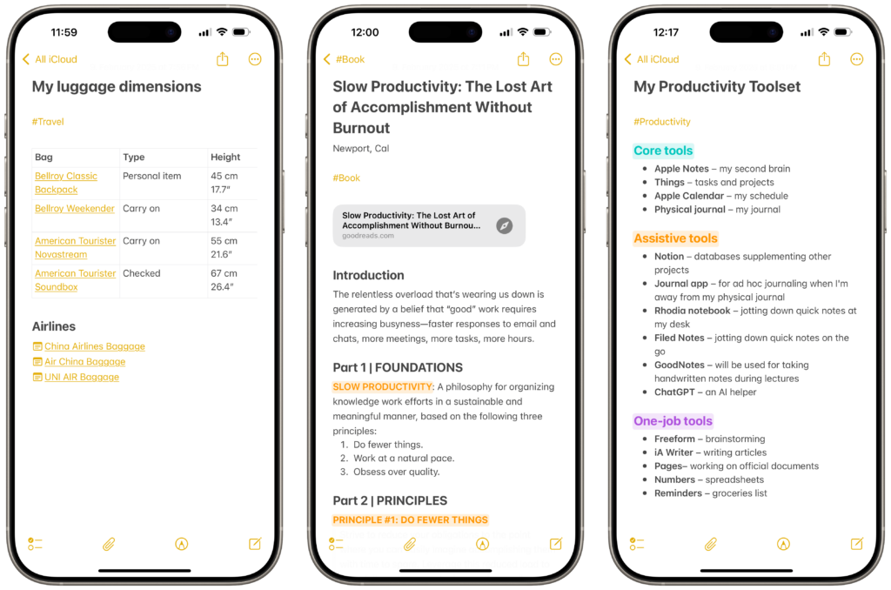

<figcaption>

Examples of notes I keep in Apple Notes

</figcaption>

</figure>

## What I Use Apple Notes For

These days, I spend at least an hour a day using Apple Notes. Here are some examples of things I keep in there:

- Notes from online courses I take (by far, the longest notes I have);

- Highlights from articles added using [Quick Notes](https://support.apple.com/en-ph/guide/safari/ibrw40158bf7/mac);

- Highlights from books I read on Kindle;

- Hand-written brainstorms using Apple Pencil on my iPad Pro;

- Keeping track of my [Personal OKRs](https://www.whatmatters.com/faqs/okrs-for-personal-life-goals-examples) and [Yearly Theme](https://www.youtube.com/watch?v=NVGuFdX5guE);

- My quarterly and annual reflections;

- Reference notes, like the dimensions and weight of all of my luggage pieces, manuals in PDFs, award flight policies of my favorite airlines, etc.;

- Notes related to my fitness and mental health goals;

- Coffee-related notes, like settings of my grinder, ratios for different brewing methods, and taste profiles based on origin;

- Random notes with ideas, temporary information, etc.

Of course, this doesn't cover _all_ types of notes I keep, but it should give you a general idea of how Apple Notes became the key part of my productivity system. I also use other, more task-oriented writing apps alongside it:

- **[iA Writer](https://ia.net/writer)** for blog article drafts and longer writing in [Markdown](https://www.markdownguide.org);

- **Apple Pages** for documents and my resume (if you're wondering, [I'm currently looking for a new opportunity](https://www.linkedin.com/in/dmarcinkowskipl/));

- **[Notion](https://affiliate.notion.so/aw7786o4w9dw)** for a handful of intricate databases, including my blog post ideas and content pipeline.

That being said, almost everything that goes through the aforementioned apps has its origins in Apple Notes, usually as simple outlines.

<figure>

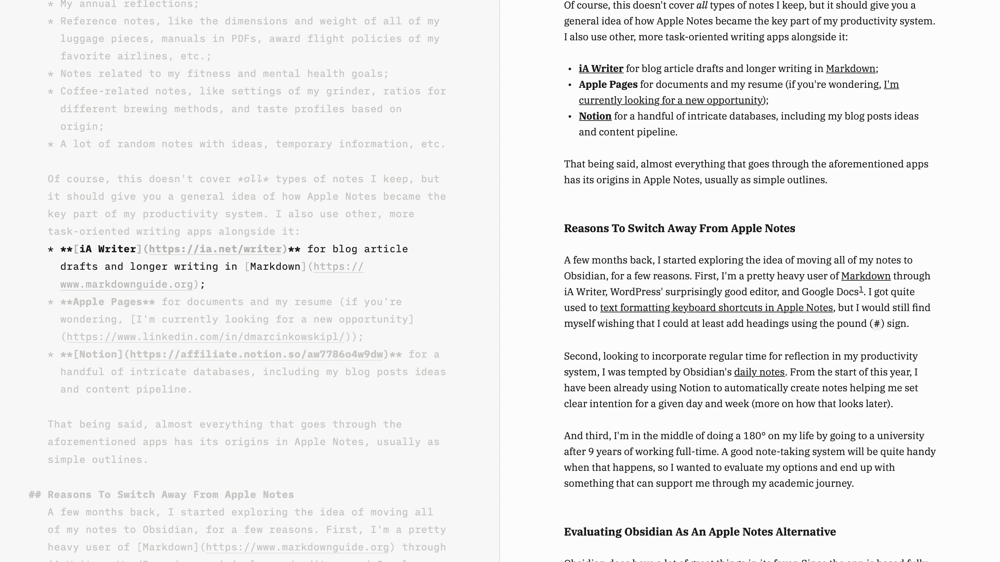

<figcaption>

Editing this article in Markdown in iA Writer

</figcaption>

</figure>

## Reasons To Switch Away From Apple Notes

A few months back, I started exploring the idea of moving all of my notes to Obsidian, for a few reasons. First, I'm a pretty heavy user of [Markdown](https://www.markdownguide.org) through iA Writer, WordPress' surprisingly good editor, and Google Docs[1](#fn1-16374 "see footnote"). I got quite used to [text formatting keyboard shortcuts in Apple Notes](https://support.apple.com/guide/notes/keyboard-shortcuts-and-gestures-apd46c25187e/mac), but I would still find myself wishing that I could at least add headings using the pound (`#`) sign.

Second, looking to incorporate regular time for reflection in my productivity system, I was tempted by Obsidian's [daily notes](https://help.obsidian.md/Plugins/Daily+notes). From the start of this year, I have been already using Notion to automatically create notes helping me set clear intentions for a given day and week (more on how that looks later).

<figure>

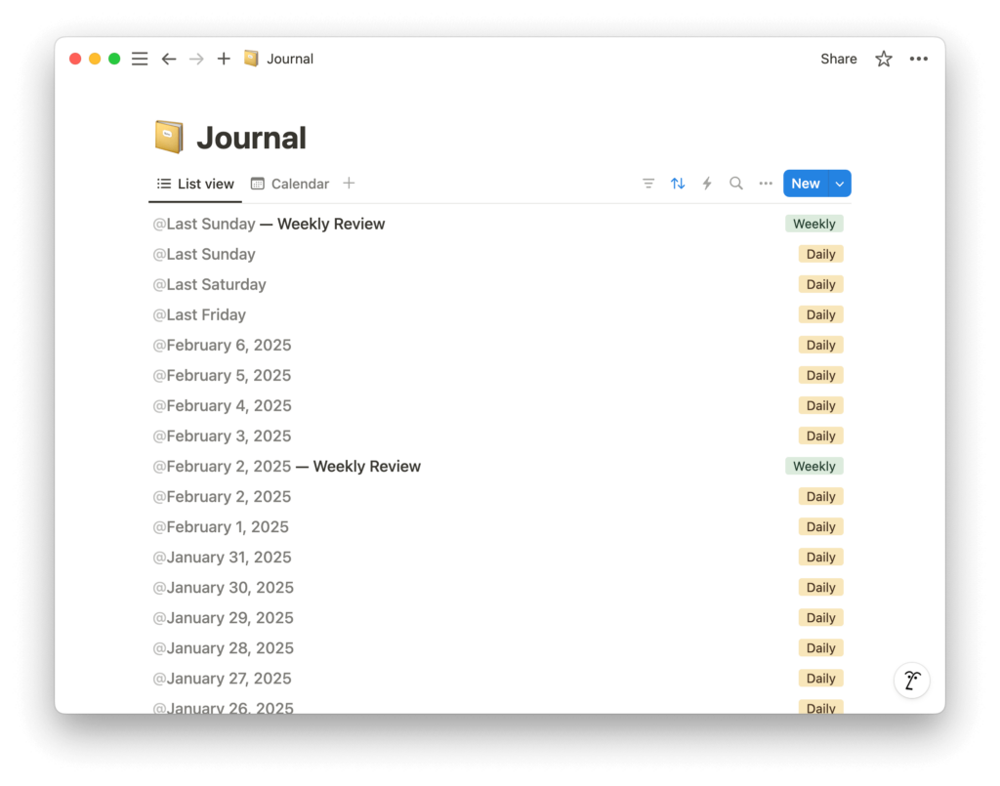

<figcaption>

My daily and weekly journal in Notion

</figcaption>

</figure>

And third, I'm in the middle of doing a 180° on my life by going to a university after 9 years of working full-time. A good note-taking system will be quite handy when that happens, so I wanted to evaluate my options and end up with something that can support me through my academic journey.

## Evaluating Obsidian As An Apple Notes Alternative

[Obsidian](https://obsidian.md) does have a lot of great things in its favor. Since the app is based fully on text files, it's very easy to just switch to a different Markdown editor, including iA Writer mentioned earlier. Unlike iA Writer, though, Obsidian lets you customize every little detail you can imagine using its long list of built-in settings and expand it even further with a vast library of community-built plugins. If there is something you don't like about the out-of-the-box experience of Obsidian or something is missing, there's a very good chance you can fix it.

<figure>

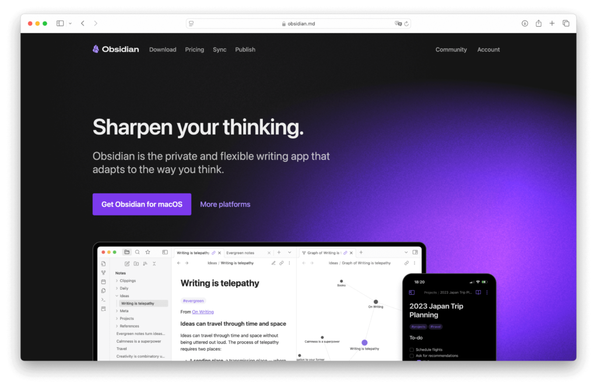

<figcaption>

Obsidian's website

</figcaption>

</figure>

I have spent a solid 20 hours over the last month or so watching, reading, and listening about how people use Obsidian. I was more than hyped to set it up for myself. But then, when I actually tried it after [importing all of my notes from Apple Notes](https://help.obsidian.md/import/apple-notes), I was paralyzed by all of the customization in my reach. Even though there are many features in Obsidian that would significantly improve my note-taking, I didn't feel like it was worth the pain I would have to go through to make it _exactly_ what I wanted it to be.

This is a bit of a digression, but in general, I tend to like software that's [opinionated](https://www.baeldung.com/cs/opinionated-software-design) and just plain simple. I do like some level of customization, but when it's overdone, I find it too overwhelming and distracting to help me achieve the goals that I intended to use the app for in the first place. This is the same reason why I love Things 3 so much. Not only is it absolutely stunning to look at, but it also has the perfect balance of customization and rigidity.

<figure>

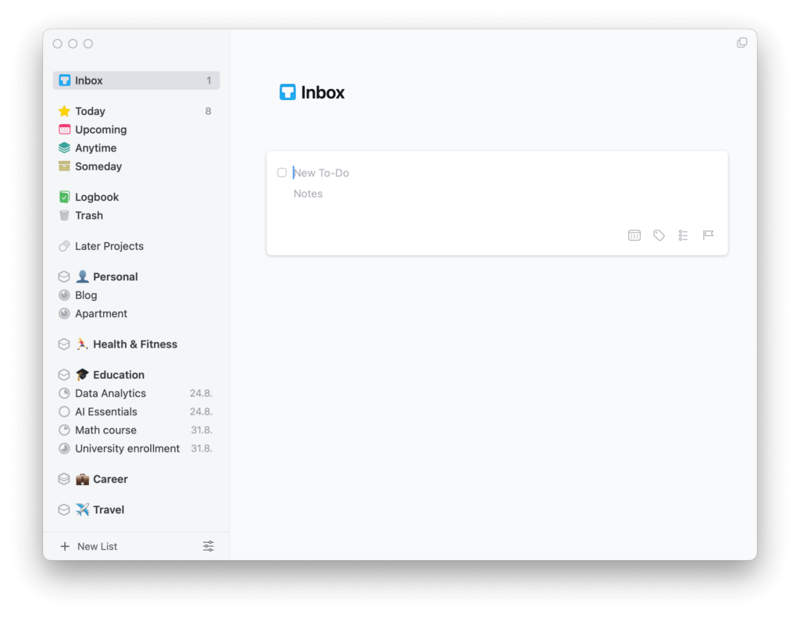

<figcaption>

Things 3

</figcaption>

</figure>

## Why Not Just Use Notion?

I did consider going all-in on Notion, too. As I mentioned earlier, I already use it for a few databases I can't imagine reproducing in Apple Notes or another app. Notion even supports some elements of Markdown syntax, allowing for basic text formatting, creating headings, and code blocks. One annoyance is that the greater-than symbol (`>`) creates an expandable block of text rather than block quotes, but it's neat peaking at this point.

As much as I love using Notion for creating and maintaining databases, I don't see myself using it as my main note-taking app. For one, there's no handwriting support on the iPad. Then, there are the mobile apps, which won't let me copy and paste things out of Notion or drag and drop text and images into the app. And of course, there's no offline support as for now, though, [allegedly](https://www.youtube.com/watch?v=l2dXXjgX4Rs), it's coming soon.

I'm aware that a lot of Notion's shortcomings, especially in regard to the quality of its mobile apps, are the results of hoops that the developers had to jump through to allow for its level of customization and complexity. As a Mac/Web app, I think Notion is great. But as a whole, it's not the kind of note-taking app I need.

## The Meme Of Personal Knowledge Management Tools

With all of that in mind, I kept thinking about this meme that you have probably seen at some point:

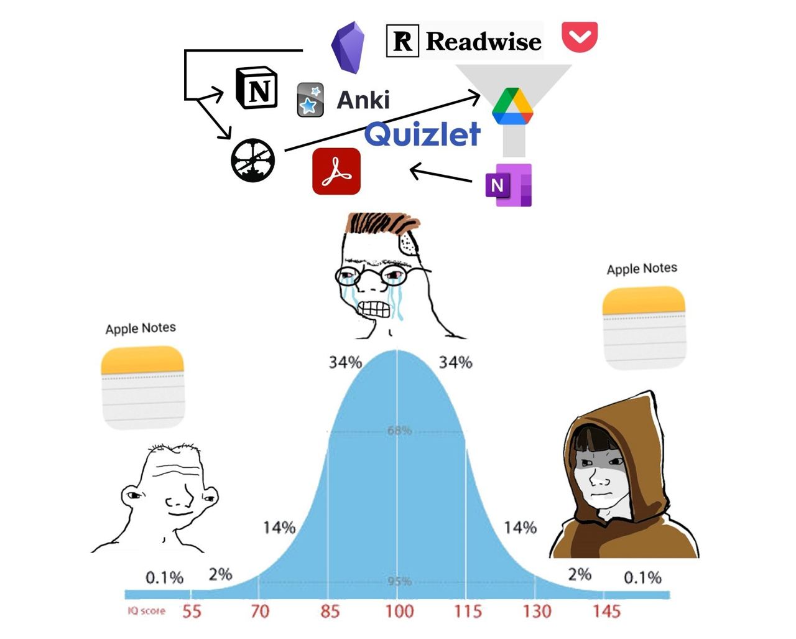

This meme portrays the reality of Personal Knowledge Management apps all too well. As I was evaluating Obsidian and Notion, deep under my skin, I knew that I would eventually go back to Apple Notes, especially as its feature set continues to mature with every new release of Apple's operating systems. [Just in iOS 18](https://www.macrumors.com/guide/ios-18-notes-app/), Notes gained collapsable headings, [Math Notes](https://support.apple.com/en-ng/guide/iphone/iph46efa613a/ios), audio recordings with transcripts, and colorful highlights.

I'm also way too deep into the Apple ecosystem not to take advantage of Notes' accessibility (like being able to [launch Quick Note from anywhere](https://support.apple.com/en-eg/guide/ipad/ipad5d91fd88/ipados)) and its deep integration with Shortcuts, other Apple apps, and the rest of the OS-level features.

## How I Use Apple Notes With Forever ✱ Notes

Now, let's dive into _how_ I use Apple Notes. Until recently, I had a pretty standard folder-based setup with a few pinned notes that I accessed on a regular basis. The top-level folders matched the areas of my life that I also use in other productivity apps: Personal, Health & Fitness, Education, Career, and Travel. Where things started to get a bit messy was with sub-folders. When fully expanded, my list of folders filled the whole height of my 14" MacBook Pro's screen. Very often, I would also feel lost deciding on where a particular note should live, as sometimes it would fit in multiple subfolders or top-level areas.

A few months back, I stumbled upon the [Forever ✱ Notes](https://www.myforevernotes.com) framework, which takes a lot of inspiration from analog journaling systems like [Bullet Journal](https://bulletjournal.com) and 5-year diary and throws in some concepts from [Tiago Forte's PARA productivity method](https://fortelabs.com/blog/para/). The system is based on the ability to [link notes together](https://support.apple.com/en-ng/guide/iphone/iph908d1558b/ios) (not unlike Obsidian) added in iOS 17[2](#fn2-16374 "see footnote").

I instantly loved Forever ✱ Notes' aesthetics and I even implemented its [✱ Home note](https://www.myforevernotes.com/docs/home) concept into my own system, but the rest of it felt like too radical of a change at that time. But, with my notes collection growing, I started to appreciate more of the framework's ideas, like the [✱ Hubs](https://www.myforevernotes.com/docs/hubs) collecting multiple notes into one, and abandoning folders in favor of [tags and smart folders](https://www.myforevernotes.com/docs/tags) for more flexibility. So I pulled the trigger and implemented the Forever ✱ Notes system into my Apple Notes.

I won't go too deep into the setup process, especially since the [Forever ✱ Notes website](https://www.myforevernotes.com) and [YouTube channel](https://www.youtube.com/channel/UCMCXOXsxsPUcXijsEJUmDlA) already do a great job at explaining every step. One recommendation I have is to use a different text replacement for [the heavy asterisk (`✱`)](https://www.myforevernotes.com/docs/the-heavy-asterisk). The `**` shortcut suggested by Matthias Hilse, creator of the Forever ✱ Notes framework, clashes with Markdown's syntax for `**making text bold**`. I use `****` instead. But you can skip it all together, too.

Now, let's go over how I have integrated all of the components of the framework into my own notes system.

<figure>

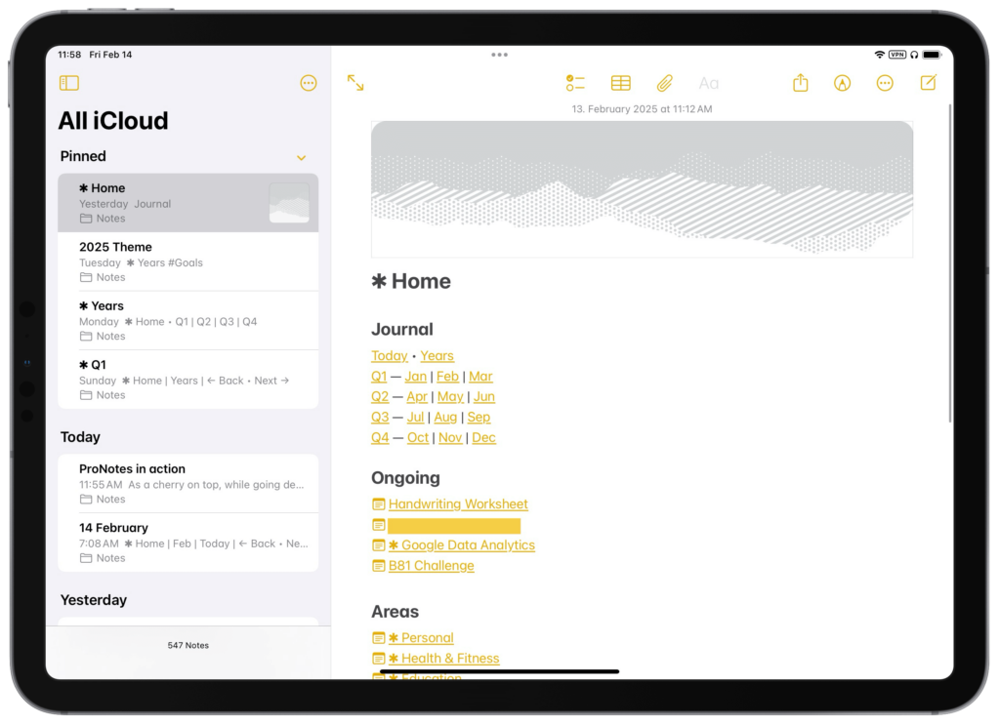

<figcaption>

My ✱ Home note

</figcaption>

</figure>

### ✱ Home Note

Having spent way too much time building dashboards in Notion, the idea of a [✱ Home note](https://www.myforevernotes.com/docs/home) hit me immediately. It's a single note linking to my ongoing projects, ✱ Hubs for different areas of life, and ✱ Journal that I will go over in a bit. At the bottom of the note, I have a link to a note with the Forever ✱ Notes cheat sheet as well as cover images from the [project's resources page](https://www.myforevernotes.com/resources).

<figure>

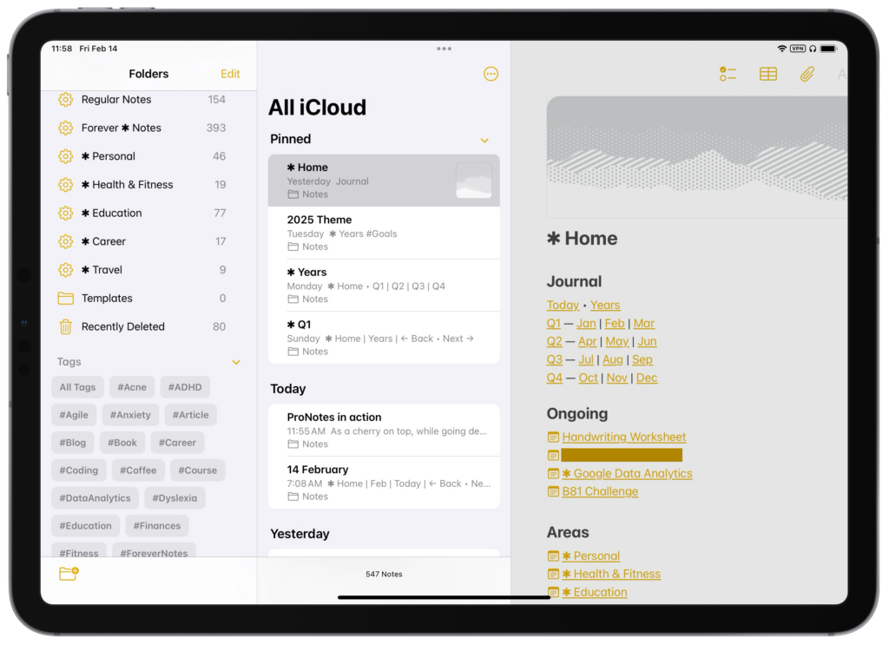

<figcaption>

Some of my ✱ Collections and tags

</figcaption>

</figure>

### Tags and ✱ Collections

Trying to give all of the Forever ✱ Notes framework's components a fair chance, I tagged all my notes for the first time. I actually ended up liking it a lot, so I went ahead and deleted my entire folder structure. Using tags (or [✱ Tags](https://www.myforevernotes.com/docs/tags)) instead of folders gives me more flexibility in categorizing my notes. I can still maintain my standard areas of life structure using Smart Folders (or [✱ Collections](https://www.myforevernotes.com/docs/collections)), but now I can have the same note be accessible in multiple folders instead of just one.

<figure>

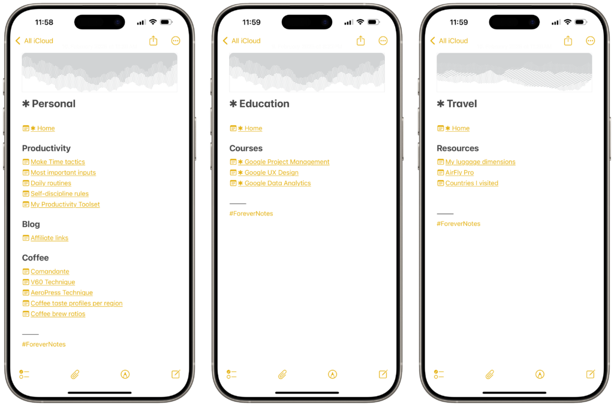

<figcaption>

A few examples of my ✱ Hubs

</figcaption>

</figure>

### ✱ Hubs

[✱ Hubs](https://www.myforevernotes.com/docs/hubs) are similar to the ✱ Home note, but they are focused on specific areas, topics, and projects rather than all of your notes. I use them to bring together the most important notes in the areas of my life I mentioned earlier (Personal, Health & Fitness, Education, Career, and Travel) and to collect multiple notes focused on the same project, like online courses I'm taking.

<figure>

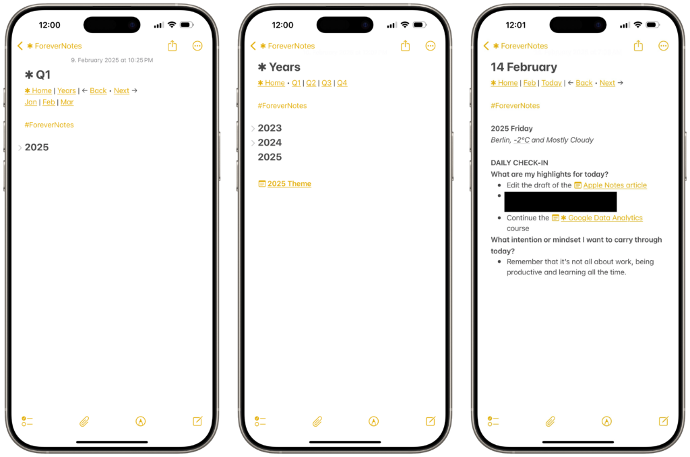

<figcaption>

Preview of my quarterly, yearly, and daily ✱ Journal entries

</figcaption>

</figure>

### ✱ Journal

The last component of the Forever ✱ Notes system is by far the most complex and hardest to implement, but it's what convinced me to give the framework a shot. [✱ Journal](https://www.myforevernotes.com/docs/journal) gives you a space to set goals, plan, and reflect across a whole year. Unlike Obsidian's daily notes, ✱ Journal in Forever ✱ Notes is capped at 384 notes: 1 for all years, 4 for quarters, 12 for months, and 366 for days. It works quite similar to 5-year diaries, where you write down your notes under the same calendar date across multiple years.

Apart from a [tedious manual setup](https://www.myforevernotes.com/docs/journal) that I won't go over, ✱ Journal perfectly fits into how I track my goals with [Personal OKRs](https://www.whatmatters.com/faqs/okrs-for-personal-life-goals-examples) on a quarterly basis and [Yearly Themes](https://www.youtube.com/watch?v=NVGuFdX5guE) annually. For **daily notes**, I'm using a slightly modified version of [this Shortcut](https://forum.myforevernotes.com/d/122-template-for-daily-note) which automatically appends my note for the day[3](#fn3-16374 "see footnote") with the following questions:

```
#### DAILY CHECK-IN
**What are my highlights for today?**
* 

**What intention or mindset I want to carry through today?**
* 

-------
```

Since there are no **weekly notes** in the Forever ✱ Notes system, I use my Sunday notes to reflect on the past and upcoming week. The same shortcut adds the following questions to help me with that:

```
#### WEEKLY REVIEW
**How did I progress towards my quarterly goals this week?**
* 

**What’s my focus priority for the upcoming week?**
* 

**What challenges did I face, and how can I address them next week?**
* 

-------
```

As for the **monthly notes**, I don't really have a use for them right now. I also don't use Bullet Journal-inspired [signifiers](https://www.myforevernotes.com/docs/journal#Signifiers) that are part of the Forever ✱ Notes system.

<figure>

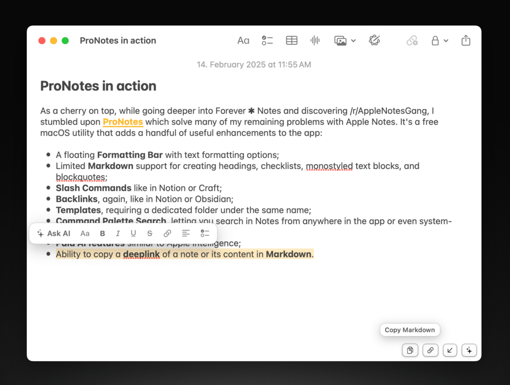

<figcaption>

ProNotes on macOS

</figcaption>

</figure>

## Making Apple Notes Even Better With ProNotes

As a cherry on top, while going deeper into Forever ✱ Notes and discovering [/r/AppleNotesGang](https://www.reddit.com/r/AppleNotesGang/comments/1hecuwu/apple_notes_as_a_second_brain_with_a_lot_of_notes/), I stumbled upon **[ProNotes](https://www.pronotes.app)** which solves many of my remaining problems with Apple Notes. It's a free macOS utility that adds a handful of useful enhancements to the app:

- A floating **Formatting Bar** with text formatting options;

- Limited **Markdown** support for creating headings, checklists, monospaced text blocks, and blockquotes;

- **Slash Commands** like in Notion or Craft;

- **Backlinks**, again, like in Notion or Obsidian;

- **Templates**, requiring a dedicated folder under the same name;

- **Command Palette Search**, letting you search in Notes from anywhere in the app or even system-wide;

- **Paid AI features** similar to Apple Intelligence;

- Ability to copy a **deeplink** of a note or its content in **Markdown**.

[NotesCmdr](https://smallest.app/notescmdr/) has a lot of the same features, but it costs $14.99 + tax.

## Embracing Apple Notes' Limitations

I will not argue if someone points out that I would be better off just by switching to Obsidian, Bear, or another Markdown-supporting app. I'm well aware of Apple Notes' limitations, but I prefer to embrace them rather than feel constrained by them. The Forever ✱ Notes framework allowed me just that by giving me a tool to rethink how I organize my notes and improve my ability to use it for goal-setting and reflection.

Especially with its recent updates, Apple Notes feels like a feature-complete app that I see myself using even when going to a university. I'm excited to see how the app is going to change in the next iteration of Apple's operating systems. I'm hoping to see more Apple Intelligence features, perhaps an ability to converse with AI about the content of my notes.

* * *

1. You can't imagine my joy when [Google added Markdown to Docs](https://support.google.com/docs/answer/12014036?hl=en). [↩︎](#fnr1-16374 "return to article")
2. You can link notes by adding a standard link (_Cmd-K_) or by typing `>>` followed by the note's name. You can also create new notes this way. [↩︎](#fnr2-16374 "return to article")
3. I run it using the ["When Waking Up" Personal Automation in Shortcuts](https://support.apple.com/en-ng/guide/shortcuts/apd932ff833f/ios). [↩︎](#fnr3-16374 "return to article")
