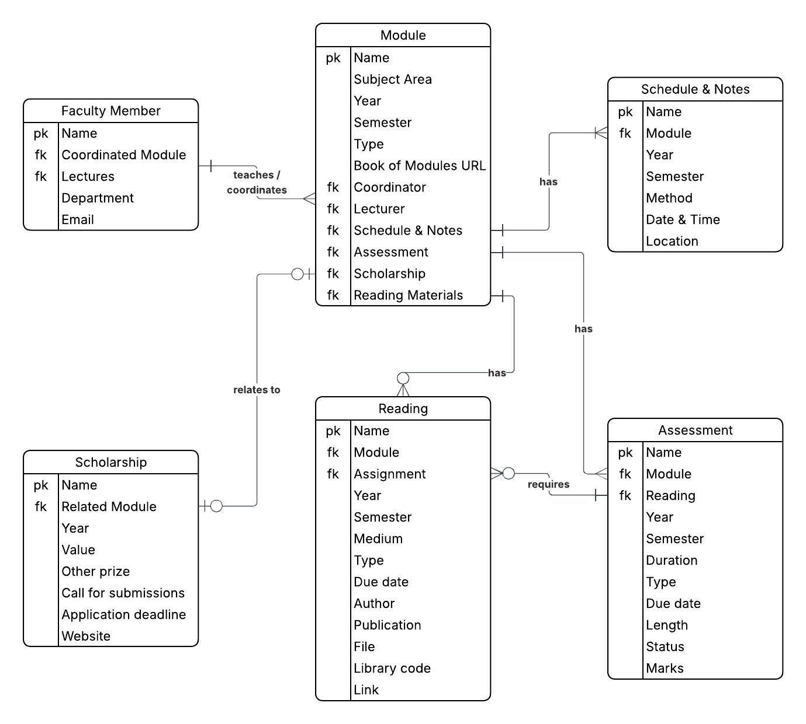
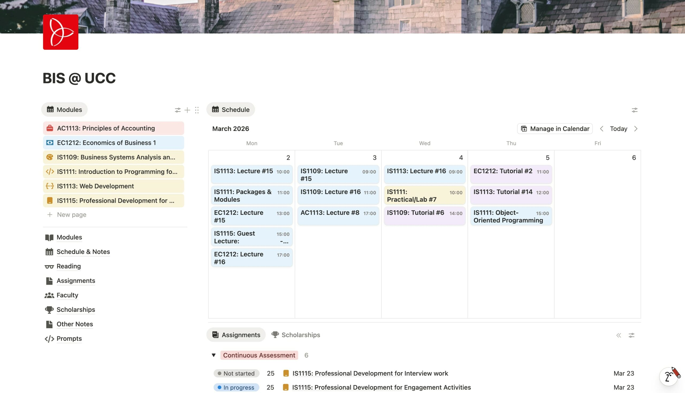
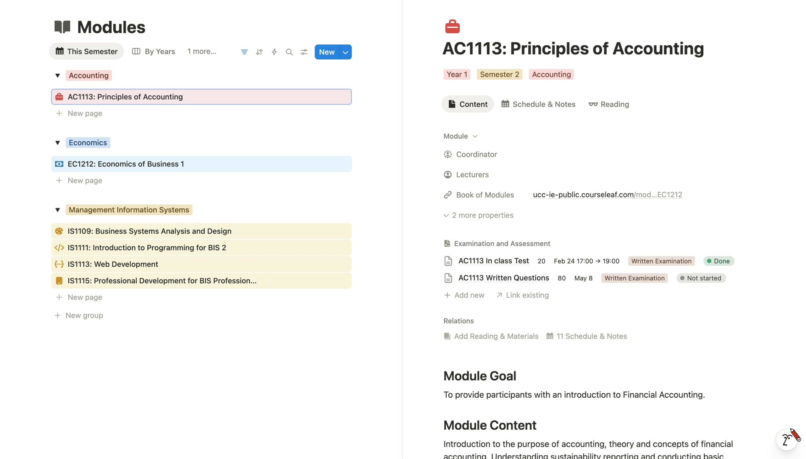
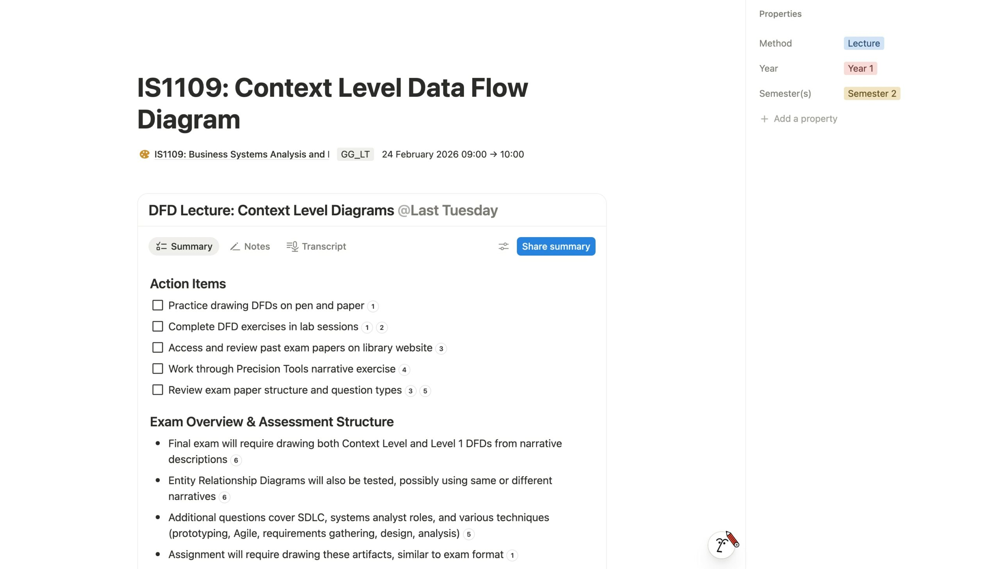
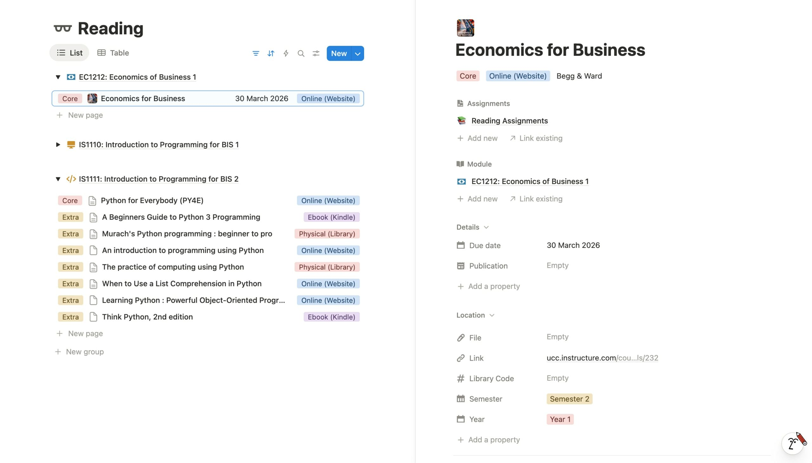
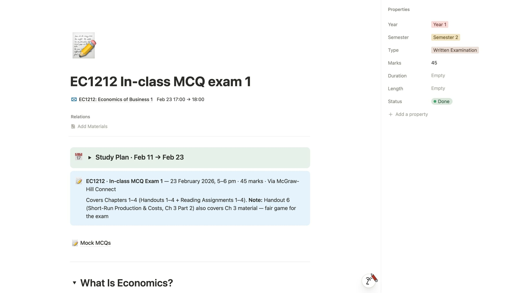
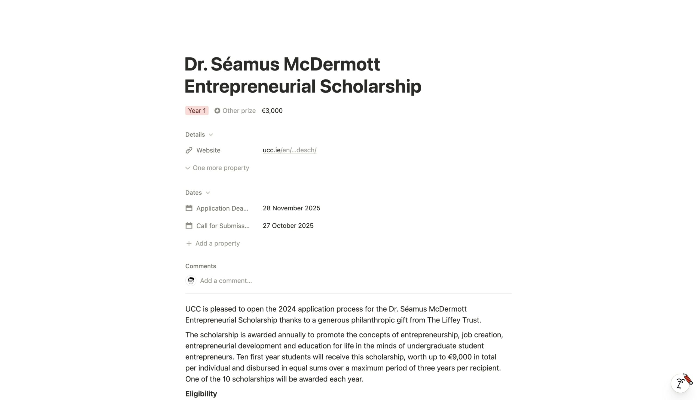

For nearly a decade, Notion has been one of the key tools in my workflow, helping me plan side projects and collaborate with colleagues and clients at companies I worked at. But since [I started college last year](/blog/on-going-to-university-at-28/), I’ve joined millions of other students for whom Notion is their primary digital workspace.

As you can imagine, with a ten-year tenure as a Notion user and, more recently, as a [Notion Ambassador](https://www.linkedin.com/feed/update/urn:li:activity:7316021103988998144/), I couldn’t settle for a simple database for my lecture notes. My university dashboard is powered by six separate databases linked together through different relations. I created a somewhat imperfect Entity Relationship Diagram (something I learned this semester!) to give you a better idea of how it all works.

<figure>

<figcaption>

An Entity Relationship Diagram of my university dashboard in Notion

</figcaption>

</figure>

A side note — the dashboard and its structure may seem quite intimidating or even counterproductive given its complexity. In reality, building it was a long and iterative process. Throughout my first semester, I removed a lot of properties from each database that turned out to be unnecessary or not worth maintaining. At one point, I even had separate databases for notes and the schedule, but quickly realised that they fit together perfectly.

I’ve made **my [University Dashboard](https://www.notion.so/en-gb/templates/university-dashboard-pro) available as a template on Notion Marketplace**. The structure and layout is exactly the same as the one I use in my own dashboard you see below, but all of the data was replaced with placeholders that you can easily replace with your own course details. If you’d rather have something simpler, you can use my alternative **[Simple University Hub](https://www.notion.so/en-gb/templates/simple-university-hub-384) template here**.

<figure>

<figcaption>

The main page of my university dashboard

</figcaption>

</figure>

## How my university dashboard works

When I open my dashboard (named _BIS @ UCC_, standing for the name of my programme: _Business Information Systems at University College Cork_), I’m presented with two columns:

On the left, there’s a small database view with my current list of modules that I can filter by year and semester. Below that are the six databases powering the whole setup: Modules, Schedule & Notes, Reading, Assignments, Faculty, and Scholarships. Further down, I have two pages: Other Notes, for loose notes on things related to university _but_ beyond my lectures, and Prompts, where I’ve started building a collection of Notion AI prompts that help me generate exam preparation notes and flashcards.

The right column has two database views: one showing the current week of lectures and tutorials, and the other showing upcoming assignments and scholarships (as two separate tabs I can switch between).

<figure>

<figcaption>

Modules database and an example page within it

</figcaption>

</figure>

### Modules

The Modules database is just that — a list of _all_ modules covered during my course’s four-year runtime. Each module has the properties you’d expect: name, subject area (or department), year, semester, and whether it’s a core module or an elective. The remaining properties are based on relations with other databases, which I’ll cover shortly. You can already see that I’ve used Notion’s relatively new Customise Layout feature to surface things like relevant assignments, notes, and reading materials directly on the module page.

I use the content section of every module page to store information from my university’s Book of Modules, which covers examination details, learning outcomes, and more. If lecturers share additional details during class or via Canvas (our digital student platform), I add those here too.

<figure>

<figcaption>

An example of a typical page in the Schedule & Notes database

</figcaption>

</figure>

### Schedule & Notes

Schedule & Notes is the database that gets, by far, the most use, with 309 entries _so far_. Every lecture and tutorial gets its own page with a few key properties: module (via relation), location on campus, date and time, and teaching method (lecture, tutorial, lab, etc.).

Before every class, I add an AI Meeting Notes block and ask Notion AI to generate lecture notes based on slides and other materials I have access to beforehand. Then, I either record the lecture or paste in a transcript from a recording shared with us. The AI Meeting Notes block combines the pre-class material summary with the lecture transcript to produce a comprehensive summary. This has been incredibly useful for capturing all the information from lectures, especially when I miss key details due to my ADHD-related attention difficulties.

<figure>

<figcaption>

The Reading database and an example of a book

</figcaption>

</figure>

### Reading

Reading is where I collect reading materials and associated notes. Every entry has properties that help me easily access the material (be it a file, URL, or library code), metadata (author, publication), and relations to modules and specific assignments.

<figure>

<figcaption>

An example of an assignment page

</figcaption>

</figure>

### Assignments

The Assignments database lists all of my upcoming continuous assessments and written exams. Each page contains information about the assignment, my actual submission work, or detailed overviews of questions I can expect on exams. I even use Notion AI to generate mock exam questions based on existing materials in my workspace, which works especially well for multiple-choice exams. Properties-wise, it’s quite basic: related module, due date, assignment type, status, and so on.

### Faculty

Faculty is exactly what it sounds like — a directory of all lecturers and module coordinators I’ll encounter throughout my course. I use it to keep track of each teacher’s preferred contact method, office hours, and even name pronunciation (Irish names are something else). Each lecturer is linked to the Modules database through two relations — Lecturer and Module Coordinator — since those roles can vary from one module to another.

<figure>

<figcaption>

An example page in the Scholarships database

</figcaption>

</figure>

### Scholarships

Scholarships lets me keep track of awards I can apply for during my course. For every opportunity, I store a brief description from my university’s website, submission opening and deadline dates, and the type of award along with its value.

* * *

And that’s my university dashboard. If you like it and would like to use it yourself, you can **[get it from Notion Marketplace](https://www.notion.so/en-gb/templates/university-dashboard-pro)**. I also have a [**simpler, free version available here**](https://www.notion.so/en-gb/templates/simple-university-hub-384).
